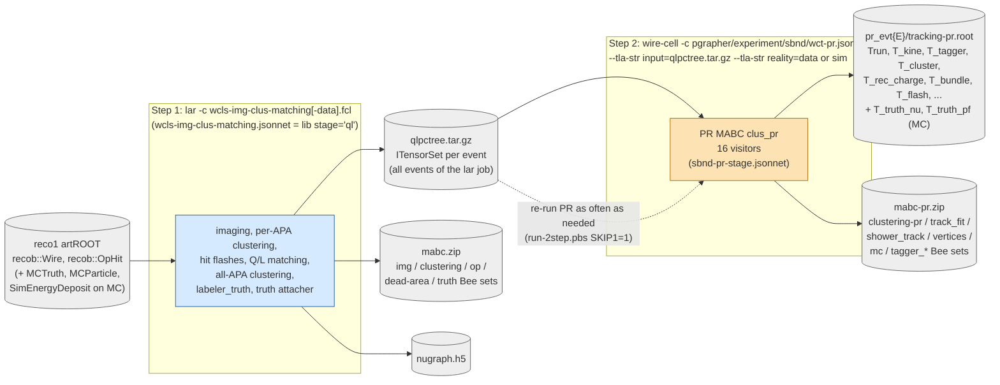
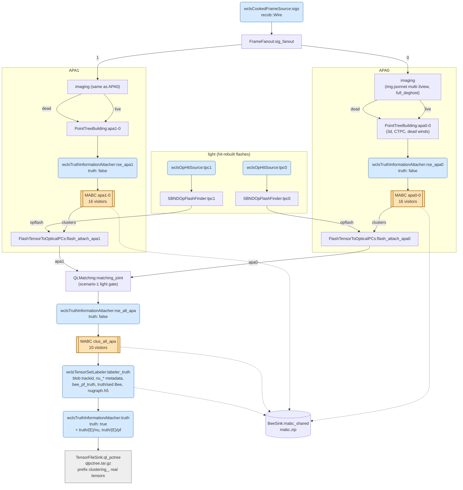
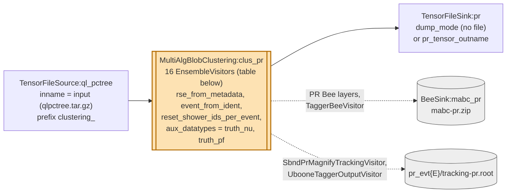
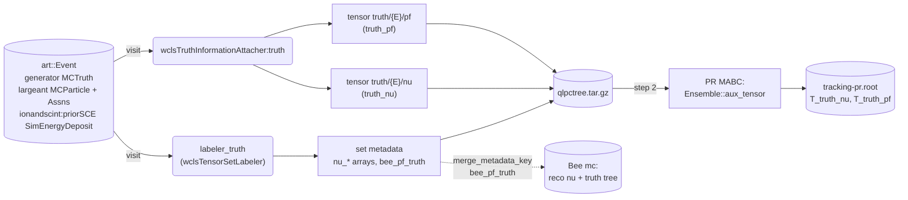

# The SBND 2-step workflow: `wcls-img-clus-matching.jsonnet` + `wct-pr.jsonnet`

The LArSoft 1-step chain (`wcls-img-clus-matching-xin-lib.jsonnet`, see [`wcls-img-clus-matching-xin-chain.md`](wcls-img-clus-matching-xin-chain.md)) is split into two jobs (ai-helper issue 33):

1. **Step 1, LArSoft (`lar`):** imaging, clustering, charge-light (Q/L) matching and all-APA clustering. It writes the matched bundles, with the light, CTPC, metadata and MC truth, to an ITensorSet tar on disk.
2. **Step 2, standalone (`wire-cell`, no art):** pattern recognition on that tar. This covers taggers, track/shower separation, trajectory fitting, vertexing, PID, particle flow, energy reconstruction and the numu/nue scores. It can be re-run as often as needed without redoing step 1.

Validated on MC-9, NCpi0-19 and nueCC-48: the output is identical to the 1-step chain, in `tracking-pr.root` and in every Bee layer (issue 33, log b and c).

Both steps build their PR stage from one definition, `sbnd-pr-stage.jsonnet`, and the 1-step chain uses the same file. The steps cannot drift apart.

## 1. Workflow

The two Bee zips together hold every layer the 1-step chain's single `mabc.zip` holds. `bee-split.py` in issue 33 merges them per event, for comparison or upload.

| | step 1 | step 2 |
|---|---|---|
| **job** | `sbnd/wcls-img-clus-matching.fcl` (MC), `-data.fcl` (data), in wcp-porting-validation | `cfg/pgrapher/experiment/sbnd/wct-pr.jsonnet` |
| **config** | `wcls-img-clus-matching.jsonnet` = `wcls-img-clus-matching-xin-lib.jsonnet(flash_source='hits', xtpc_sc1_light_gate=true, xtpc_sc1_overpred_max=2.9, stage='ql')` | TLAs `input`, `reality`, `output_dir` (`.`), `evt_subdir` (`pr_evt%1%`), `enable_tracking_root` (true), `bee_outname` (`mabc-pr.zip`), `pr_tensor_outname` (`''` = no post-PR tar) |
| **events** | any number per `lar` job, all in one tar | every tensor set in the tar, one `wire-cell` process |
| **run** | `lar -n <N> --nskip <k> -c wcls-img-clus-matching-data.fcl -s <reco1.root> --no-output` | `mkdir pr_evt<E>` for each event in the tar, then `wire-cell -c pgrapher/experiment/sbnd/wct-pr.jsonnet --tla-str input=qlpctree.tar.gz --tla-str reality=data` |
| **cost (Aurora, 2 cores)** | about 20–40 s per event | about 5–25 s per event |

## 2. Step 1: `wcls-img-clus-matching.jsonnet`

This is the 1-step graph up to and including the truth attacher: 106 nodes and 118 edges. The per-APA imaging is expanded in `wcls-img-clus-matching-xin-chain.md` section 2. The PR tail (`clus_pr`, `labeler_tagger`, `TensorFileSink:clus_all_apa`, 34 components) is replaced by one `TensorFileSink`.

- **Colours:** blue marks larwirecell components. These are art-event visitors, so each must be listed in the fcl `inputers`. Orange marks MABC nodes.
- **Visitor lists:** the three MABCs' EnsembleVisitor lists are the 1-step chain's, in `wcls-img-clus-matching-xin-chain.md` section 3.
- **`wclsTruthInformationAttacher`** replaces `wclsTensorSetMetadataAttacher`. With `truth: false` it only stamps `runNo` / `subRunNo` / `eventNo` into the set metadata, where each downstream MABC reads them (`rse_from_metadata`).
- **The `truth` instance** also appends the two MC truth tables described in section 3. On data it stamps the RSE only.

## 3. What travels in `qlpctree.tar.gz`

This is one ITensorSet per event, keyed by the set ident (the art event number). As measured on an MC tar:

| datapath | datatype | content | needed by |
|---|---|---|---|
| `pointtrees/<E>/live` | `pctree` (+159 `pcarray`, 23 `pcdataset`) | the matched live clusters, listed below | the whole PR stage |
| `pointtrees/<E>/dead` | `pctree` (+26 `pcarray`) | the dead (masked) grouping | `MakeFiducialUtils` |
| `truth/<E>/nu` | `truth_nu` | one row per neutrino (MC); columns in the tensor metadata | `T_truth_nu` |
| `truth/<E>/pf` | `truth_pf` | one row per particle of the truth particle flow (MC) | `T_truth_pf` |
| `truthtracks/<E>` | `truth_per_track` | the labeler's beam-nu primaries table (MC) | not read |

The live clusters carry:
- blob `3d` points, with `x_t0cor`, `y_cor`, `z_cor`, the per-plane charge, and `trackid` on MC;
- `ctpc_a{0,1}f0p{U,V,W}`, the 2D charge used for the Steiner graph and the trajectory fit;
- `dead_winds_*` and `dead_gap_*`;
- the light: `flash`, `light`, `flashlight`, `opflash`;
- the provenance in `perblob`: `real_cluster_*` and `assoc_cluster_*`;
- the flags and `matched_flash_gid` in `cluster_scalar`.

**Set metadata:** `runNo`, `subRunNo`, `eventNo`; the labeler's `n_nu` and `nu_*` arrays; and on MC `bee_pf_truth`, the truth particle tree the PR MABC merges into Bee `mc`.

**`truth_nu` columns:** `nu_idx, pdg, ccnc, mode, int_type, flavor, E, vtx_x, vtx_y, vtx_z, t, edep`.

**`truth_pf` columns:** `nu_row, trackid, parent_trackid, mother_trackid, pdg, process, E, KE, start_x/y/z/t, end_x/y/z/t, start_px/py/pz`. The rows are beam-neutrino-derived particles with KE > 10 MeV, each attached to its nearest kept ancestor, the same selection as the Bee `mc` tree. Units are cm, ns and GeV.

## 4. Step 2: `wct-pr.jsonnet`

Standalone: 3 nodes, 2 edges and 44 configured components.

- **Multi-event:** one process runs every event of the tar.
  - The per-event outputs go to `output_dir/pr_evt<E>/`, where `<E>` is the set ident. The runner must create those directories.
  - `reset_shower_ids_per_event` restarts the shower-id counter at each event. Each event's ids then equal a one-event process's, which is required for identity with the 1-step chain.
- **RSE:** taken from the step-1 metadata, which MABC ranks above the ident. `event_from_ident` is only the required partner of `evt_subdir`.
- **Truth:** the MABC publishes the input tensors of datatype `truth_nu` / `truth_pf` on the Ensemble (`Ensemble::aux_tensor`) and forwards them to its output. `SbndPrMagnifyTrackingVisitor` writes them as `T_truth_nu` / `T_truth_pf`: one entry per row, plus `runNo`, `subRunNo` and `eventNo`, with identifier columns as `Int_t`. On data they are absent, so no truth trees are written.
- **Bee sink:** `BeeSink:mabc_pr` is listed explicitly in the job's config, because `pr()` names its sink without listing it in its `uses`.

### EnsembleVisitors of `MultiAlgBlobClustering:clus_pr`

Visitors 1–15 are exactly the 1-step chain's PR MABC (`sbnd-pr-stage.jsonnet`, `pr()` defaults = the SBND production operating point). Visitor 16 is appended in step 2 only.

| # | EnsembleVisitor (type:name) | what it does |
|---|---|---|
| 1 | `ClusteringSwitchScope:pr` | switch to T0Correction coords |
| 2 | `ClusteringUnmergeBundle:pr` | split flash-merged bundles (real_cluster_id provenance, from step 1) |
| 3 | `ClusteringUnmergeBundle:prassoc` | split isolated groupings (assoc_cluster_id / assoc_cluster_main, from step 1) |
| 4 | `CreateSteinerGraph:pr` | Steiner graph (uses the CTPC) |
| 5 | `MakeFiducialUtils:pr` | fiducial utils from the live + dead groupings |
| 6 | `TaggerCheckTGM:pr` | through-going muon tagger |
| 7 | `TaggerCheckSTM:pr` | stopping muon tagger |
| 8 | `TaggerCheckFC:pr` | fully-contained check |
| 9 | `ClusteringProtectBundle:pr` | Protect_Over_Clustering, after the cosmic taggers |
| 10 | `CreateSteinerGraph:prrefresh` | rebuild the Steiner products the split purged |
| 11 | `TaggerCheckNeutrino:pr` | neutrino tagger: vertex, trajectory fit, track/shower, PID, particle flow, energy |
| 12 | `UbooneNumuBDTScorer:pr` | numu score (XGBoost `numu_scalars_scores_0923.xml`) |
| 13 | `UbooneNueBDTScorer:pr` | nue score (XGBoost `XGB_nue_seed2_0923.xml`); the Bee `mc` particle flow is dumped after it |
| 14 | `SbndPrMagnifyTrackingVisitor:pr` | `pr_evt<E>/tracking-pr.root` (RECREATE), incl. `T_truth_nu` / `T_truth_pf` on MC |
| 15 | `UbooneTaggerOutputVisitor:pr` | adds `T_tagger` / `T_kine` (UPDATE) |
| 16 | `TaggerBeeVisitor:pr` | **step 2 only**: the `tagger_stm/tgm/fc/lm` Bee sets (in the 1-step, the art-side `labeler_tagger` writes them) |

## 5. The MC truth, from art to `tracking-pr.root`

The labeler and the attacher read the same art products with the same particle selection. The G4 process codes come from one shared header, `larwirecell/aiml/G4ProcessCode.h`. issue 33's `check-truth.py` confirms that the two agree event by event.

## 6. Files

| file | repo | role |
|---|---|---|
| `cfg/pgrapher/experiment/sbnd/wcls-img-clus-matching-xin-lib.jsonnet` | toolkit | the chain as a function; `stage='1step'` (full 1-step) or `'ql'` (step 1) |
| `cfg/pgrapher/experiment/sbnd/wcls-img-clus-matching.jsonnet` | toolkit | step 1 top-level job |
| `cfg/pgrapher/experiment/sbnd/wct-pr.jsonnet` | toolkit | step 2 top-level job |
| `cfg/pgrapher/experiment/sbnd/sbnd-pr-stage.jsonnet` | toolkit | the PR stage, shared by the 1-step and step 2 |
| `cfg/pgrapher/experiment/sbnd/clus.jsonnet` | toolkit | `pr()`, including its `tagger_bee` entry |
| `clus/src/TaggerBeeVisitor.cxx` | toolkit | tagger Bee sets from inside the PR MABC |
| `clus/inc/WireCellClus/Facade_Ensemble.h`, `MultiAlgBlobClustering.*` | toolkit | auxiliary (truth) tensors |
| `root/src/SbndPrMagnifyTrackingVisitor.cxx` | toolkit | `T_truth_nu` / `T_truth_pf` |
| `larwirecell/Components/TruthInformationAttacher.*` | larwirecell | `wclsTruthInformationAttacher` |
| `larwirecell/aiml/G4ProcessCode.h`, `TensorSetLabeler.*` | larwirecell | shared process codes; per-event RNG re-seed, which makes multi-event step-1 jobs reproducible |
| `sbnd/wcls-img-clus-matching{,-data}.fcl`, `sbnd/wcls-img-clus-matching.jsonnet` | wcp-porting-validation | step 1 fcls and the re-export |

The harness and validation scripts are in `issues/33-sbnd-1step-to-2step/scripts/` of wire-cell-toolkit-ai-helper:
- `run-2step.pbs`: both steps and the comparison; `SKIP1=1,RUN_DIR=` re-runs only PR;
- `gate-2step-cfg.sh`: the configuration gates;
- `check-truth.py`, `bee-split.py`, `bee-diff.py`, `evt-table-2step.py`.
