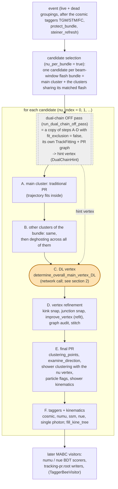
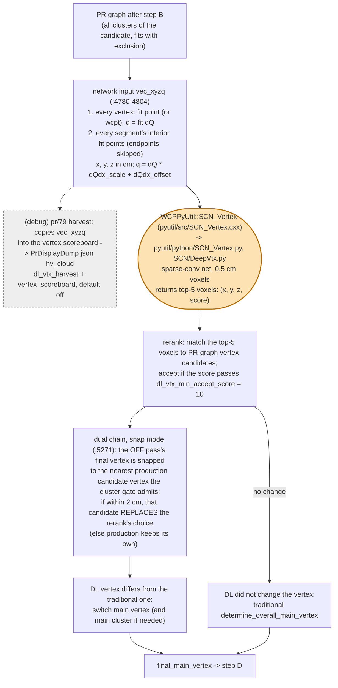

# The SBND neutrino PR around the DL vertex

This page shows where the deep-learning (DL) neutrino-vertex inference sits in the SBND pattern recognition: what runs before it, what it reads, and what runs after it (ai-helper issue 35, M1).

It was surveyed at toolkit `c3cce7f3`, at the SBND production operating point. That is `pr()`'s defaults, the step-2 `wct-pr.jsonnet` / 1-step `clus_pr` `TaggerCheckNeutrino` configuration:
- `nu_per_bundle = true`;
- `fit_exclusion = true`;
- `dl_weights = uboone/scn_vtx/t48k-m16-l5-lr5d-res0.5-CP24.pth`;
- `dl_vtx_rerank = true`, `dl_vtx_top_k = 5`, `dl_vtx_min_accept_score = 10`, `dl_vtx_score_scale = 1000`;
- `dl_vtx_dual_chain = true`, `dual_chain_mode = snap`, `dual_chain_transfer = true`, `dual_chain_transfer_max = 2` cm.

Short answer to "(traditional vertexing) -> (trajectory fitting) -> (DL vertexing) -> (trajectory fitting) -> (final PR)": that is the right shape, with three refinements.
1. **Trajectory fitting is not a separate stage before the DL.** It runs inside the traditional vertexing: `find_proto_vertex`, its structure examination and `determine_main_vertex` refit as they edit the graph. The DL input is the fit state those stages leave behind, after `deghosting`, with fit exclusion on.
2. **There are two chains.** The dual chain first runs an exclusion-free copy of the whole vertexing ("OFF pass", including its own DL call). Its final vertex becomes a hint: the production candidate vertex nearest to it replaces the production DL choice if it lies within 2 cm. So each candidate makes two network calls on two different point clouds.
3. **The points in `tracking-pr.root` are not the network input.** They are written after `improve_vertex` and the later refits, so they differ from the input. Training on them is a domain mismatch (issue 35, task 2).

## 1. Per event

All of this happens inside one MABC visitor, `TaggerCheckNeutrino::visit()` (`clus/src/TaggerCheckNeutrino.cxx:1901`). The MABC's later visitors (BDT scorers, ROOT writers) follow.

The stages, with anchors in `TaggerCheckNeutrino.cxx` (production pass):

| stage | calls | anchor |
|---|---|---|
| OFF pass | `run_dual_chain_off_pass` (steps A–D duplicated, `fit_exclusion = false`, harvest off) | `:3641-3647`, body `:4604` |
| A | `find_proto_vertex` (`init_first_segment`, `break_segments`, `examine_structure`), `clustering_points`, `separate_track_shower`, `determine_direction`, `shower_determining_in_main_cluster`, `determine_main_vertex` (candidate scoring + `improve_vertex`), `reassociate_cluster_orphans` | `:3657-3694` |
| B | the same per other cluster (clusters ≤ 6 cm take `init_point_segment`), then `deghosting` | `:3708-3753` |
| C | `determine_overall_main_vertex_DL`; if it changes nothing, the traditional `determine_overall_main_vertex` | `:3765-3805` |
| D | `snap_main_vertex_to_kink`, `snap_main_vertex_to_junction`, `improve_vertex`, `main_vertex_graph_audit`, `stitch_disconnected_main_cluster` | `:3823-3885` |
| E | `clustering_points`, `examine_direction`, `demote_cross_cluster_straight_stems`, `orphan_dup_audit`, `shower_clustering_with_nv`, `reconcile_particle_flags`, `calculate_shower_kinematics` | `:3894-4072` |
| F | `cosmic_tagger`, `numu_tagger`, `ssm_tagger`, `nue_tagger`, `singlephoton_tagger`, `fill_kine_tree` | `:4206-4348` |

## 2. The DL step

`PatternAlgorithms::determine_overall_main_vertex_DL` (`clus/src/NeutrinoVertexFinder.cxx:4703`).

- **Two inputs per candidate.** The OFF pass builds the same kind of cloud from its exclusion-free fit and calls the same network. Its result is the snap hint. Its harvest is disabled, so its input isn't recorded anywhere today.
- **The input is exact only at this point.** Afterwards, step D's `improve_vertex` and the audits refit the trajectory around the chosen vertex, and steps E and F work on that refit graph.
- **What gets written:**
  - `tracking-pr.root` (`T_rec_charge`, the fit points) and the Bee `track_fit` layer are written from the final graph.
  - The calib JSON (`PrDisplayDump`) holds the final graph, plus the exact production-pass input when the harvest is on.

## 3. Where the trajectory is (re)fit

Every `TrackFitting::do_multi_tracking` call site in the neutrino PR, by function (production pass):

| function | do_multi_tracking calls | runs in stage |
|---|---|---|
| `find_proto_vertex` | 3 | A, B |
| `init_point_segment` | 1 | B (short clusters) |
| `examine_structure`, `examine_structure_final_1/1p/2/3` | 2 + 1 + 1 + 1 + 1 | A, B (structure examination) |
| `examine_vertices_1/2/3/4`, `examine_partial_identical_segments`, `crawl_segment` | 1 + 1 + 2 + 2, 2, 1 | A, B |
| `find_other_segments`, `merge_nearby_vertices`, `replace_segment_and_vertex` | 3, 1, 2 | A, B |
| `compare_main_vertices_all_showers` | 1 | A, B (`determine_main_vertex`) |
| `improve_vertex` | 6 | A, B (`determine_main_vertex`), D |
| `determine_overall_main_vertex_DL` | 1 | C (only with `dl_vtx_cloud_no_exclusion`, off: an exclusion-free refit for the cloud, then restored) |
| `snap_main_vertex_to_kink` | 1 | D (inert unless `vertex_kink_snap`) |
| `main_vertex_graph_audit`, `stitch_disconnected_main_cluster` | 3, 1 | D |
| `orphan_dup_audit` | 1 | E |

The OFF pass repeats the A–D rows on its own fitter, with exclusion off.

## 4. Where issue 35 adds dump points

These are planned, not implemented yet.

| point | what | how |
|---|---|---|
| each network call, OFF and production | the exact `vec_xyzq` and the call's top-K payload, tagged `pass`, `nu_index` | a knob `dl_vtx_dump`, default off, written as `T_dlvtx_cloud` / `T_dlvtx_call` in `tracking-pr.root` |
| the decision | the reranked choice, the snap outcome, the traditional vertex, the final vertex | `T_dlvtx_call` |
| MC truth | the in-detector `truth_nu` vertex, transformed into the cloud's frame | `T_dlvtx_call` (MC only) |
| standalone check | re-run `SCN_Vertex.SCN_Vertex` on `T_dlvtx_cloud` and compare with `T_dlvtx_call` | ai-helper script |
