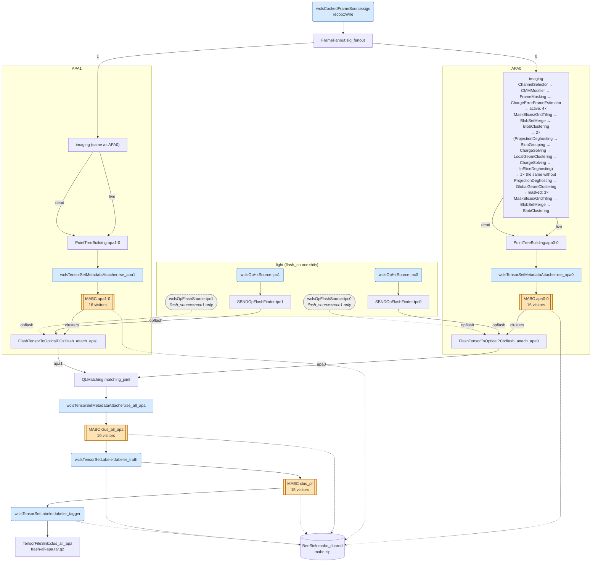

# The SBND LArSoft 1-step chain: `wcls-img-clus-matching-pr-lib.jsonnet`

This page shows every component that `wcls-img-clus-matching-pr-lib.jsonnet` puts in the Pgrapher graph, and the EnsembleVisitor pipeline of each `MultiAlgBlobClustering` (MABC) node.

It was generated from the **compiled** configuration, not from reading the jsonnet: `wcsonnet` output of `wcls-img-clus-matching-pr-hits.jsonnet` at toolkit `c7e7775e`, with the sim extVar set of `wcls-img-clus-matching-pr-hits.fcl`. That output has 107 graph nodes, 119 edges and 228 configured components in total.

The variants differ only in the light nodes:

| job | light path per TPC | QLMatching |
|---|---|---|
| `wcls-img-clus-matching-pr-hits.jsonnet` (`flash_source='hits'`) | `wclsOpHitSource:tpc<N>` → `SBNDOpFlashFinder:tpc<N>` | `xtpc_sc1_light_gate=true`, `xtpc_sc1_overpred_max=2.9` |
| `wcls-img-clus-matching-pr-flash.jsonnet` (`flash_source='reco1'`, default) | `wclsOpFlashSource:tpc<N>` (art `recob::OpFlash`) | keys omitted (C++ default, gate off) |

- **sim vs data:** `reality=sim` and `reality=data` compile to the same graph and the same MABC visitor lists.
- **`enable_tracking_root=false`:** drops the last two PR visitors (`SbndPrMagnifyTrackingVisitor`, `UbooneTaggerOutputVisitor`).

## 1. Overview

Each box stands for one stage. Both APAs have the same imaging block; section 2 expands every node.



- **Colours:** blue marks larwirecell (`wcls*`) components, which are also `inputers` in the fcl and see the `art::Event`. Orange marks the MABC nodes; grey dashed marks the reco1-only alternative.
- **Bee edges:** the dotted edges to `mabc.zip` are not graph edges. They show that the node writes into the one shared `BeeSink:mabc_shared`.

## 2. Full graph: all 107 nodes and 119 edges

This is generated mechanically from the compiled Pgrapher edge list (see section 5).

- **Edge labels:** give the input port, where a node has more than one input.
- **Dashed edges:** the `wclsOpFlashSource` nodes are the `flash_source=reco1` replacement for the `wclsOpHitSource` → `SBNDOpFlashFinder` pair.

```mermaid
flowchart TB
  subgraph charge ["art input: recob::Wire"]
    wclsCookedFrameSource_sigs("wclsCookedFrameSource<br/>sigs")
    FrameFanout_sig_fanout["FrameFanout<br/>sig_fanout"]
  end
  subgraph img0 ["imaging APA0 (img.jsonnet multi-3view, full_deghost)"]
    direction LR
    ChannelSelector_chsel0["ChannelSelector<br/>chsel0"]
    GlobalGeomClustering_global_clustering_apa0_ms_active["GlobalGeomClustering<br/>global-clustering-apa0-ms-active"]
    BlobClustering_blobclustering_apa0_ms_masked["BlobClustering<br/>blobclustering-apa0-ms-masked"]
    ChargeErrorFrameEstimator_cefe_apa0["ChargeErrorFrameEstimator<br/>cefe-apa0"]
    FrameFanout_fan_active_masked_apa0["FrameFanout<br/>fan_active_masked-apa0"]
    CMMModifier_cmm_mod_apa0["CMMModifier<br/>cmm-mod-apa0"]
    FrameMasking_frame_masking_apa0["FrameMasking<br/>frame-masking-apa0"]
    FrameFanout_multi_active_slicing_tiling_apa0["FrameFanout<br/>multi_active_slicing_tiling-apa0"]
    FrameFanout_multi_masked_slicing_tiling_apa0["FrameFanout<br/>multi_masked_slicing_tiling-apa0"]
    BlobSetMerge_multi_active_slicing_tiling_apa0["BlobSetMerge<br/>multi_active_slicing_tiling-apa0"]
    BlobClustering_blobclustering_apa0_ms_active["BlobClustering<br/>blobclustering-apa0-ms-active"]
    MaskSlices_slicing_apa0_ms_active_0["MaskSlices<br/>slicing-apa0-ms-active_0"]
    MaskSlices_slicing_apa0_ms_active_1["MaskSlices<br/>slicing-apa0-ms-active_1"]
    MaskSlices_slicing_apa0_ms_active_2["MaskSlices<br/>slicing-apa0-ms-active_2"]
    MaskSlices_slicing_apa0_ms_active_3["MaskSlices<br/>slicing-apa0-ms-active_3"]
    GridTiling_tiling_apa0_ms_active_0_face0["GridTiling<br/>tiling-apa0-ms-active_0-face0"]
    GridTiling_tiling_apa0_ms_active_1_face0["GridTiling<br/>tiling-apa0-ms-active_1-face0"]
    GridTiling_tiling_apa0_ms_active_2_face0["GridTiling<br/>tiling-apa0-ms-active_2-face0"]
    GridTiling_tiling_apa0_ms_active_3_face0["GridTiling<br/>tiling-apa0-ms-active_3-face0"]
    ProjectionDeghosting_ProjectionDeghosting_apa0_ms_active1st["ProjectionDeghosting<br/>ProjectionDeghosting-apa0-ms-active1st"]
    BlobGrouping_blobgrouping_apa0_ms_active1st["BlobGrouping<br/>blobgrouping-apa0-ms-active1st"]
    ChargeSolving_cs2_apa0_ms_active1st["ChargeSolving<br/>cs2-apa0-ms-active1st"]
    InSliceDeghosting_inslice_deghosting_apa0_ms_active1st["InSliceDeghosting<br/>inslice_deghosting-apa0-ms-active1st"]
    ProjectionDeghosting_ProjectionDeghosting_apa0_ms_active2nd["ProjectionDeghosting<br/>ProjectionDeghosting-apa0-ms-active2nd"]
    BlobGrouping_blobgrouping_apa0_ms_active2nd["BlobGrouping<br/>blobgrouping-apa0-ms-active2nd"]
    ChargeSolving_cs2_apa0_ms_active2nd["ChargeSolving<br/>cs2-apa0-ms-active2nd"]
    InSliceDeghosting_inslice_deghosting_apa0_ms_active2nd["InSliceDeghosting<br/>inslice_deghosting-apa0-ms-active2nd"]
    BlobGrouping_blobgrouping_apa0_ms_active3rd["BlobGrouping<br/>blobgrouping-apa0-ms-active3rd"]
    ChargeSolving_cs2_apa0_ms_active3rd["ChargeSolving<br/>cs2-apa0-ms-active3rd"]
    InSliceDeghosting_inslice_deghosting_apa0_ms_active3rd["InSliceDeghosting<br/>inslice_deghosting-apa0-ms-active3rd"]
    ChargeSolving_cs1_apa0_ms_active1st["ChargeSolving<br/>cs1-apa0-ms-active1st"]
    LocalGeomClustering_local_clustering_apa0_ms_active1st["LocalGeomClustering<br/>local-clustering-apa0-ms-active1st"]
    ChargeSolving_cs1_apa0_ms_active2nd["ChargeSolving<br/>cs1-apa0-ms-active2nd"]
    LocalGeomClustering_local_clustering_apa0_ms_active2nd["LocalGeomClustering<br/>local-clustering-apa0-ms-active2nd"]
    ChargeSolving_cs1_apa0_ms_active3rd["ChargeSolving<br/>cs1-apa0-ms-active3rd"]
    LocalGeomClustering_local_clustering_apa0_ms_active3rd["LocalGeomClustering<br/>local-clustering-apa0-ms-active3rd"]
    BlobSetMerge_multi_masked_slicing_tiling_apa0["BlobSetMerge<br/>multi_masked_slicing_tiling-apa0"]
    MaskSlices_slicing_apa0_ms_masked_0["MaskSlices<br/>slicing-apa0-ms-masked_0"]
    MaskSlices_slicing_apa0_ms_masked_1["MaskSlices<br/>slicing-apa0-ms-masked_1"]
    MaskSlices_slicing_apa0_ms_masked_2["MaskSlices<br/>slicing-apa0-ms-masked_2"]
    GridTiling_tiling_apa0_ms_masked_0_face0["GridTiling<br/>tiling-apa0-ms-masked_0-face0"]
    GridTiling_tiling_apa0_ms_masked_1_face0["GridTiling<br/>tiling-apa0-ms-masked_1-face0"]
    GridTiling_tiling_apa0_ms_masked_2_face0["GridTiling<br/>tiling-apa0-ms-masked_2-face0"]
  end
  subgraph img1 ["imaging APA1 (same as APA0)"]
    direction LR
    ChannelSelector_chsel1["ChannelSelector<br/>chsel1"]
    GlobalGeomClustering_global_clustering_apa1_ms_active["GlobalGeomClustering<br/>global-clustering-apa1-ms-active"]
    BlobClustering_blobclustering_apa1_ms_masked["BlobClustering<br/>blobclustering-apa1-ms-masked"]
    ChargeErrorFrameEstimator_cefe_apa1["ChargeErrorFrameEstimator<br/>cefe-apa1"]
    FrameFanout_fan_active_masked_apa1["FrameFanout<br/>fan_active_masked-apa1"]
    CMMModifier_cmm_mod_apa1["CMMModifier<br/>cmm-mod-apa1"]
    FrameMasking_frame_masking_apa1["FrameMasking<br/>frame-masking-apa1"]
    FrameFanout_multi_active_slicing_tiling_apa1["FrameFanout<br/>multi_active_slicing_tiling-apa1"]
    FrameFanout_multi_masked_slicing_tiling_apa1["FrameFanout<br/>multi_masked_slicing_tiling-apa1"]
    BlobSetMerge_multi_active_slicing_tiling_apa1["BlobSetMerge<br/>multi_active_slicing_tiling-apa1"]
    BlobClustering_blobclustering_apa1_ms_active["BlobClustering<br/>blobclustering-apa1-ms-active"]
    MaskSlices_slicing_apa1_ms_active_0["MaskSlices<br/>slicing-apa1-ms-active_0"]
    MaskSlices_slicing_apa1_ms_active_1["MaskSlices<br/>slicing-apa1-ms-active_1"]
    MaskSlices_slicing_apa1_ms_active_2["MaskSlices<br/>slicing-apa1-ms-active_2"]
    MaskSlices_slicing_apa1_ms_active_3["MaskSlices<br/>slicing-apa1-ms-active_3"]
    GridTiling_tiling_apa1_ms_active_0_face1["GridTiling<br/>tiling-apa1-ms-active_0-face1"]
    GridTiling_tiling_apa1_ms_active_1_face1["GridTiling<br/>tiling-apa1-ms-active_1-face1"]
    GridTiling_tiling_apa1_ms_active_2_face1["GridTiling<br/>tiling-apa1-ms-active_2-face1"]
    GridTiling_tiling_apa1_ms_active_3_face1["GridTiling<br/>tiling-apa1-ms-active_3-face1"]
    ProjectionDeghosting_ProjectionDeghosting_apa1_ms_active1st["ProjectionDeghosting<br/>ProjectionDeghosting-apa1-ms-active1st"]
    BlobGrouping_blobgrouping_apa1_ms_active1st["BlobGrouping<br/>blobgrouping-apa1-ms-active1st"]
    ChargeSolving_cs2_apa1_ms_active1st["ChargeSolving<br/>cs2-apa1-ms-active1st"]
    InSliceDeghosting_inslice_deghosting_apa1_ms_active1st["InSliceDeghosting<br/>inslice_deghosting-apa1-ms-active1st"]
    ProjectionDeghosting_ProjectionDeghosting_apa1_ms_active2nd["ProjectionDeghosting<br/>ProjectionDeghosting-apa1-ms-active2nd"]
    BlobGrouping_blobgrouping_apa1_ms_active2nd["BlobGrouping<br/>blobgrouping-apa1-ms-active2nd"]
    ChargeSolving_cs2_apa1_ms_active2nd["ChargeSolving<br/>cs2-apa1-ms-active2nd"]
    InSliceDeghosting_inslice_deghosting_apa1_ms_active2nd["InSliceDeghosting<br/>inslice_deghosting-apa1-ms-active2nd"]
    BlobGrouping_blobgrouping_apa1_ms_active3rd["BlobGrouping<br/>blobgrouping-apa1-ms-active3rd"]
    ChargeSolving_cs2_apa1_ms_active3rd["ChargeSolving<br/>cs2-apa1-ms-active3rd"]
    InSliceDeghosting_inslice_deghosting_apa1_ms_active3rd["InSliceDeghosting<br/>inslice_deghosting-apa1-ms-active3rd"]
    ChargeSolving_cs1_apa1_ms_active1st["ChargeSolving<br/>cs1-apa1-ms-active1st"]
    LocalGeomClustering_local_clustering_apa1_ms_active1st["LocalGeomClustering<br/>local-clustering-apa1-ms-active1st"]
    ChargeSolving_cs1_apa1_ms_active2nd["ChargeSolving<br/>cs1-apa1-ms-active2nd"]
    LocalGeomClustering_local_clustering_apa1_ms_active2nd["LocalGeomClustering<br/>local-clustering-apa1-ms-active2nd"]
    ChargeSolving_cs1_apa1_ms_active3rd["ChargeSolving<br/>cs1-apa1-ms-active3rd"]
    LocalGeomClustering_local_clustering_apa1_ms_active3rd["LocalGeomClustering<br/>local-clustering-apa1-ms-active3rd"]
    BlobSetMerge_multi_masked_slicing_tiling_apa1["BlobSetMerge<br/>multi_masked_slicing_tiling-apa1"]
    MaskSlices_slicing_apa1_ms_masked_0["MaskSlices<br/>slicing-apa1-ms-masked_0"]
    MaskSlices_slicing_apa1_ms_masked_1["MaskSlices<br/>slicing-apa1-ms-masked_1"]
    MaskSlices_slicing_apa1_ms_masked_2["MaskSlices<br/>slicing-apa1-ms-masked_2"]
    GridTiling_tiling_apa1_ms_masked_0_face1["GridTiling<br/>tiling-apa1-ms-masked_0-face1"]
    GridTiling_tiling_apa1_ms_masked_1_face1["GridTiling<br/>tiling-apa1-ms-masked_1-face1"]
    GridTiling_tiling_apa1_ms_masked_2_face1["GridTiling<br/>tiling-apa1-ms-masked_2-face1"]
  end
  subgraph clus0 ["per-APA clustering APA0"]
    PointTreeBuilding_apa0_0["PointTreeBuilding<br/>apa0-0"]
    MultiAlgBlobClustering_apa0_0[["MultiAlgBlobClustering<br/>apa0-0"]]
    wclsTensorSetMetadataAttacher_rse_apa0["wclsTensorSetMetadataAttacher<br/>rse_apa0"]
  end
  subgraph clus1 ["per-APA clustering APA1"]
    PointTreeBuilding_apa1_0["PointTreeBuilding<br/>apa1-0"]
    MultiAlgBlobClustering_apa1_0[["MultiAlgBlobClustering<br/>apa1-0"]]
    wclsTensorSetMetadataAttacher_rse_apa1["wclsTensorSetMetadataAttacher<br/>rse_apa1"]
  end
  subgraph light0 ["light TPC0 (flash_source=hits)"]
    SBNDOpFlashFinder_tpc0["SBNDOpFlashFinder<br/>tpc0"]
    wclsOpHitSource_tpc0("wclsOpHitSource<br/>tpc0")
    reco1_0(["wclsOpFlashSource<br/>tpc0<br/><i>flash_source=reco1 only</i>"])
  end
  subgraph light1 ["light TPC1 (flash_source=hits)"]
    SBNDOpFlashFinder_tpc1["SBNDOpFlashFinder<br/>tpc1"]
    wclsOpHitSource_tpc1("wclsOpHitSource<br/>tpc1")
    reco1_1(["wclsOpFlashSource<br/>tpc1<br/><i>flash_source=reco1 only</i>"])
  end
  subgraph match ["Q/L matching (joint over both APAs)"]
    FlashTensorToOpticalPCs_flash_attach_apa0["FlashTensorToOpticalPCs<br/>flash_attach_apa0"]
    FlashTensorToOpticalPCs_flash_attach_apa1["FlashTensorToOpticalPCs<br/>flash_attach_apa1"]
    QLMatching_matching_joint["QLMatching<br/>matching_joint"]
  end
  subgraph tail ["all-APA clustering, PR, labelers"]
    wclsTensorSetMetadataAttacher_rse_all_apa["wclsTensorSetMetadataAttacher<br/>rse_all_apa"]
    MultiAlgBlobClustering_clus_all_apa[["MultiAlgBlobClustering<br/>clus_all_apa"]]
    wclsTensorSetLabeler_labeler_truth["wclsTensorSetLabeler<br/>labeler_truth"]
    MultiAlgBlobClustering_clus_pr[["MultiAlgBlobClustering<br/>clus_pr"]]
    wclsTensorSetLabeler_labeler_tagger["wclsTensorSetLabeler<br/>labeler_tagger"]
    TensorFileSink_clus_all_apa["TensorFileSink<br/>clus_all_apa"]
  end
  wclsCookedFrameSource_sigs --> FrameFanout_sig_fanout
  FrameFanout_sig_fanout --> ChannelSelector_chsel0
  FrameFanout_sig_fanout -->|1| ChannelSelector_chsel1
  GlobalGeomClustering_global_clustering_apa0_ms_active -->|live| PointTreeBuilding_apa0_0
  GlobalGeomClustering_global_clustering_apa1_ms_active -->|live| PointTreeBuilding_apa1_0
  BlobClustering_blobclustering_apa0_ms_masked -->|dead| PointTreeBuilding_apa0_0
  BlobClustering_blobclustering_apa1_ms_masked -->|dead| PointTreeBuilding_apa1_0
  MultiAlgBlobClustering_apa0_0 -->|clusters| FlashTensorToOpticalPCs_flash_attach_apa0
  MultiAlgBlobClustering_apa1_0 -->|clusters| FlashTensorToOpticalPCs_flash_attach_apa1
  SBNDOpFlashFinder_tpc0 -->|opflash| FlashTensorToOpticalPCs_flash_attach_apa0
  SBNDOpFlashFinder_tpc1 -->|opflash| FlashTensorToOpticalPCs_flash_attach_apa1
  FlashTensorToOpticalPCs_flash_attach_apa0 -->|apa0| QLMatching_matching_joint
  FlashTensorToOpticalPCs_flash_attach_apa1 -->|apa1| QLMatching_matching_joint
  QLMatching_matching_joint --> wclsTensorSetMetadataAttacher_rse_all_apa
  wclsTensorSetMetadataAttacher_rse_all_apa --> MultiAlgBlobClustering_clus_all_apa
  MultiAlgBlobClustering_clus_all_apa --> wclsTensorSetLabeler_labeler_truth
  wclsTensorSetLabeler_labeler_truth --> MultiAlgBlobClustering_clus_pr
  MultiAlgBlobClustering_clus_pr --> wclsTensorSetLabeler_labeler_tagger
  wclsTensorSetLabeler_labeler_tagger --> TensorFileSink_clus_all_apa
  ChargeErrorFrameEstimator_cefe_apa0 --> FrameFanout_fan_active_masked_apa0
  ChannelSelector_chsel0 --> CMMModifier_cmm_mod_apa0
  CMMModifier_cmm_mod_apa0 --> FrameMasking_frame_masking_apa0
  FrameMasking_frame_masking_apa0 --> ChargeErrorFrameEstimator_cefe_apa0
  FrameFanout_fan_active_masked_apa0 --> FrameFanout_multi_active_slicing_tiling_apa0
  FrameFanout_fan_active_masked_apa0 -->|1| FrameFanout_multi_masked_slicing_tiling_apa0
  BlobSetMerge_multi_active_slicing_tiling_apa0 --> BlobClustering_blobclustering_apa0_ms_active
  FrameFanout_multi_active_slicing_tiling_apa0 --> MaskSlices_slicing_apa0_ms_active_0
  FrameFanout_multi_active_slicing_tiling_apa0 -->|1| MaskSlices_slicing_apa0_ms_active_1
  FrameFanout_multi_active_slicing_tiling_apa0 -->|2| MaskSlices_slicing_apa0_ms_active_2
  FrameFanout_multi_active_slicing_tiling_apa0 -->|3| MaskSlices_slicing_apa0_ms_active_3
  GridTiling_tiling_apa0_ms_active_0_face0 -->|0| BlobSetMerge_multi_active_slicing_tiling_apa0
  GridTiling_tiling_apa0_ms_active_1_face0 -->|1| BlobSetMerge_multi_active_slicing_tiling_apa0
  GridTiling_tiling_apa0_ms_active_2_face0 -->|2| BlobSetMerge_multi_active_slicing_tiling_apa0
  GridTiling_tiling_apa0_ms_active_3_face0 -->|3| BlobSetMerge_multi_active_slicing_tiling_apa0
  MaskSlices_slicing_apa0_ms_active_0 --> GridTiling_tiling_apa0_ms_active_0_face0
  MaskSlices_slicing_apa0_ms_active_1 --> GridTiling_tiling_apa0_ms_active_1_face0
  MaskSlices_slicing_apa0_ms_active_2 --> GridTiling_tiling_apa0_ms_active_2_face0
  MaskSlices_slicing_apa0_ms_active_3 --> GridTiling_tiling_apa0_ms_active_3_face0
  BlobClustering_blobclustering_apa0_ms_active --> ProjectionDeghosting_ProjectionDeghosting_apa0_ms_active1st
  ProjectionDeghosting_ProjectionDeghosting_apa0_ms_active1st --> BlobGrouping_blobgrouping_apa0_ms_active1st
  ChargeSolving_cs2_apa0_ms_active1st --> InSliceDeghosting_inslice_deghosting_apa0_ms_active1st
  InSliceDeghosting_inslice_deghosting_apa0_ms_active1st --> ProjectionDeghosting_ProjectionDeghosting_apa0_ms_active2nd
  ProjectionDeghosting_ProjectionDeghosting_apa0_ms_active2nd --> BlobGrouping_blobgrouping_apa0_ms_active2nd
  ChargeSolving_cs2_apa0_ms_active2nd --> InSliceDeghosting_inslice_deghosting_apa0_ms_active2nd
  InSliceDeghosting_inslice_deghosting_apa0_ms_active2nd --> BlobGrouping_blobgrouping_apa0_ms_active3rd
  ChargeSolving_cs2_apa0_ms_active3rd --> InSliceDeghosting_inslice_deghosting_apa0_ms_active3rd
  InSliceDeghosting_inslice_deghosting_apa0_ms_active3rd --> GlobalGeomClustering_global_clustering_apa0_ms_active
  BlobGrouping_blobgrouping_apa0_ms_active1st --> ChargeSolving_cs1_apa0_ms_active1st
  ChargeSolving_cs1_apa0_ms_active1st --> LocalGeomClustering_local_clustering_apa0_ms_active1st
  LocalGeomClustering_local_clustering_apa0_ms_active1st --> ChargeSolving_cs2_apa0_ms_active1st
  BlobGrouping_blobgrouping_apa0_ms_active2nd --> ChargeSolving_cs1_apa0_ms_active2nd
  ChargeSolving_cs1_apa0_ms_active2nd --> LocalGeomClustering_local_clustering_apa0_ms_active2nd
  LocalGeomClustering_local_clustering_apa0_ms_active2nd --> ChargeSolving_cs2_apa0_ms_active2nd
  BlobGrouping_blobgrouping_apa0_ms_active3rd --> ChargeSolving_cs1_apa0_ms_active3rd
  ChargeSolving_cs1_apa0_ms_active3rd --> LocalGeomClustering_local_clustering_apa0_ms_active3rd
  LocalGeomClustering_local_clustering_apa0_ms_active3rd --> ChargeSolving_cs2_apa0_ms_active3rd
  BlobSetMerge_multi_masked_slicing_tiling_apa0 --> BlobClustering_blobclustering_apa0_ms_masked
  FrameFanout_multi_masked_slicing_tiling_apa0 --> MaskSlices_slicing_apa0_ms_masked_0
  FrameFanout_multi_masked_slicing_tiling_apa0 -->|1| MaskSlices_slicing_apa0_ms_masked_1
  FrameFanout_multi_masked_slicing_tiling_apa0 -->|2| MaskSlices_slicing_apa0_ms_masked_2
  GridTiling_tiling_apa0_ms_masked_0_face0 -->|0| BlobSetMerge_multi_masked_slicing_tiling_apa0
  GridTiling_tiling_apa0_ms_masked_1_face0 -->|1| BlobSetMerge_multi_masked_slicing_tiling_apa0
  GridTiling_tiling_apa0_ms_masked_2_face0 -->|2| BlobSetMerge_multi_masked_slicing_tiling_apa0
  MaskSlices_slicing_apa0_ms_masked_0 --> GridTiling_tiling_apa0_ms_masked_0_face0
  MaskSlices_slicing_apa0_ms_masked_1 --> GridTiling_tiling_apa0_ms_masked_1_face0
  MaskSlices_slicing_apa0_ms_masked_2 --> GridTiling_tiling_apa0_ms_masked_2_face0
  ChargeErrorFrameEstimator_cefe_apa1 --> FrameFanout_fan_active_masked_apa1
  ChannelSelector_chsel1 --> CMMModifier_cmm_mod_apa1
  CMMModifier_cmm_mod_apa1 --> FrameMasking_frame_masking_apa1
  FrameMasking_frame_masking_apa1 --> ChargeErrorFrameEstimator_cefe_apa1
  FrameFanout_fan_active_masked_apa1 --> FrameFanout_multi_active_slicing_tiling_apa1
  FrameFanout_fan_active_masked_apa1 -->|1| FrameFanout_multi_masked_slicing_tiling_apa1
  BlobSetMerge_multi_active_slicing_tiling_apa1 --> BlobClustering_blobclustering_apa1_ms_active
  FrameFanout_multi_active_slicing_tiling_apa1 --> MaskSlices_slicing_apa1_ms_active_0
  FrameFanout_multi_active_slicing_tiling_apa1 -->|1| MaskSlices_slicing_apa1_ms_active_1
  FrameFanout_multi_active_slicing_tiling_apa1 -->|2| MaskSlices_slicing_apa1_ms_active_2
  FrameFanout_multi_active_slicing_tiling_apa1 -->|3| MaskSlices_slicing_apa1_ms_active_3
  GridTiling_tiling_apa1_ms_active_0_face1 -->|0| BlobSetMerge_multi_active_slicing_tiling_apa1
  GridTiling_tiling_apa1_ms_active_1_face1 -->|1| BlobSetMerge_multi_active_slicing_tiling_apa1
  GridTiling_tiling_apa1_ms_active_2_face1 -->|2| BlobSetMerge_multi_active_slicing_tiling_apa1
  GridTiling_tiling_apa1_ms_active_3_face1 -->|3| BlobSetMerge_multi_active_slicing_tiling_apa1
  MaskSlices_slicing_apa1_ms_active_0 --> GridTiling_tiling_apa1_ms_active_0_face1
  MaskSlices_slicing_apa1_ms_active_1 --> GridTiling_tiling_apa1_ms_active_1_face1
  MaskSlices_slicing_apa1_ms_active_2 --> GridTiling_tiling_apa1_ms_active_2_face1
  MaskSlices_slicing_apa1_ms_active_3 --> GridTiling_tiling_apa1_ms_active_3_face1
  BlobClustering_blobclustering_apa1_ms_active --> ProjectionDeghosting_ProjectionDeghosting_apa1_ms_active1st
  ProjectionDeghosting_ProjectionDeghosting_apa1_ms_active1st --> BlobGrouping_blobgrouping_apa1_ms_active1st
  ChargeSolving_cs2_apa1_ms_active1st --> InSliceDeghosting_inslice_deghosting_apa1_ms_active1st
  InSliceDeghosting_inslice_deghosting_apa1_ms_active1st --> ProjectionDeghosting_ProjectionDeghosting_apa1_ms_active2nd
  ProjectionDeghosting_ProjectionDeghosting_apa1_ms_active2nd --> BlobGrouping_blobgrouping_apa1_ms_active2nd
  ChargeSolving_cs2_apa1_ms_active2nd --> InSliceDeghosting_inslice_deghosting_apa1_ms_active2nd
  InSliceDeghosting_inslice_deghosting_apa1_ms_active2nd --> BlobGrouping_blobgrouping_apa1_ms_active3rd
  ChargeSolving_cs2_apa1_ms_active3rd --> InSliceDeghosting_inslice_deghosting_apa1_ms_active3rd
  InSliceDeghosting_inslice_deghosting_apa1_ms_active3rd --> GlobalGeomClustering_global_clustering_apa1_ms_active
  BlobGrouping_blobgrouping_apa1_ms_active1st --> ChargeSolving_cs1_apa1_ms_active1st
  ChargeSolving_cs1_apa1_ms_active1st --> LocalGeomClustering_local_clustering_apa1_ms_active1st
  LocalGeomClustering_local_clustering_apa1_ms_active1st --> ChargeSolving_cs2_apa1_ms_active1st
  BlobGrouping_blobgrouping_apa1_ms_active2nd --> ChargeSolving_cs1_apa1_ms_active2nd
  ChargeSolving_cs1_apa1_ms_active2nd --> LocalGeomClustering_local_clustering_apa1_ms_active2nd
  LocalGeomClustering_local_clustering_apa1_ms_active2nd --> ChargeSolving_cs2_apa1_ms_active2nd
  BlobGrouping_blobgrouping_apa1_ms_active3rd --> ChargeSolving_cs1_apa1_ms_active3rd
  ChargeSolving_cs1_apa1_ms_active3rd --> LocalGeomClustering_local_clustering_apa1_ms_active3rd
  LocalGeomClustering_local_clustering_apa1_ms_active3rd --> ChargeSolving_cs2_apa1_ms_active3rd
  BlobSetMerge_multi_masked_slicing_tiling_apa1 --> BlobClustering_blobclustering_apa1_ms_masked
  FrameFanout_multi_masked_slicing_tiling_apa1 --> MaskSlices_slicing_apa1_ms_masked_0
  FrameFanout_multi_masked_slicing_tiling_apa1 -->|1| MaskSlices_slicing_apa1_ms_masked_1
  FrameFanout_multi_masked_slicing_tiling_apa1 -->|2| MaskSlices_slicing_apa1_ms_masked_2
  GridTiling_tiling_apa1_ms_masked_0_face1 -->|0| BlobSetMerge_multi_masked_slicing_tiling_apa1
  GridTiling_tiling_apa1_ms_masked_1_face1 -->|1| BlobSetMerge_multi_masked_slicing_tiling_apa1
  GridTiling_tiling_apa1_ms_masked_2_face1 -->|2| BlobSetMerge_multi_masked_slicing_tiling_apa1
  MaskSlices_slicing_apa1_ms_masked_0 --> GridTiling_tiling_apa1_ms_masked_0_face1
  MaskSlices_slicing_apa1_ms_masked_1 --> GridTiling_tiling_apa1_ms_masked_1_face1
  MaskSlices_slicing_apa1_ms_masked_2 --> GridTiling_tiling_apa1_ms_masked_2_face1
  PointTreeBuilding_apa0_0 --> wclsTensorSetMetadataAttacher_rse_apa0
  wclsTensorSetMetadataAttacher_rse_apa0 --> MultiAlgBlobClustering_apa0_0
  PointTreeBuilding_apa1_0 --> wclsTensorSetMetadataAttacher_rse_apa1
  wclsTensorSetMetadataAttacher_rse_apa1 --> MultiAlgBlobClustering_apa1_0
  wclsOpHitSource_tpc0 --> SBNDOpFlashFinder_tpc0
  wclsOpHitSource_tpc1 --> SBNDOpFlashFinder_tpc1
  reco1_0 -.->|opflash| FlashTensorToOpticalPCs_flash_attach_apa0
  reco1_1 -.->|opflash| FlashTensorToOpticalPCs_flash_attach_apa1
  classDef mabc fill:#fde2b3,stroke:#b36b00,stroke-width:2px
  classDef art fill:#d6eaff,stroke:#1f5fa8
  classDef alt fill:#eeeeee,stroke:#888,stroke-dasharray:4 3
  class MultiAlgBlobClustering_apa0_0,MultiAlgBlobClustering_apa1_0,MultiAlgBlobClustering_clus_all_apa,MultiAlgBlobClustering_clus_pr mabc
  class wclsCookedFrameSource_sigs,wclsTensorSetMetadataAttacher_rse_all_apa,wclsTensorSetLabeler_labeler_truth,wclsTensorSetLabeler_labeler_tagger,wclsTensorSetMetadataAttacher_rse_apa0,wclsTensorSetMetadataAttacher_rse_apa1,wclsOpHitSource_tpc0,wclsOpHitSource_tpc1 art
  class reco1_0,reco1_1 alt
```

## 3. EnsembleVisitors of each MABC node

The visitors are listed in execution order, which is the order of the node's `pipeline`. The names are the configured `type:name`. Notes quote the compiled configuration or the comments in the jsonnet.

### `MultiAlgBlobClustering:apa0-0` (per-APA, APA0): 16 visitors

Bee sets written: `clustering`. In `pointtrees/%d`, out `pointtrees/%d`.

| # | EnsembleVisitor (type:name) | notes |
|---|---|---|
| 1 | `ClusteringPointed:apa0-0` |  |
| 2 | `ClusteringLiveDead:apa0-0` |  |
| 3 | `ClusteringExtend:apa0-0` |  |
| 4 | `ClusteringRegular:apa0-0-one` | length_cut 600, flag_enable_extend false |
| 5 | `ClusteringRegular:apa0-0_two` | length_cut 300, flag_enable_extend true |
| 6 | `ClusteringParallelProlong:apa0-0` |  |
| 7 | `ClusteringClose:apa0-0` |  |
| 8 | `ClusteringExtendLoop:apa0-0` |  |
| 9 | `ClusteringSeparate:apa0-0` |  |
| 10 | `ClusteringConnect1:apa0-0` |  |
| 11 | `ClusteringDeghost:apa0-0` | graph ctpc_fast (dg_fast) |
| 12 | `ClusteringExamineXBoundary:apa0-0` |  |
| 13 | `ClusteringProtectOverclustering:apa0-0` |  |
| 14 | `ClusteringNeutrino:apa0-0` |  |
| 15 | `ClusteringIsolated:apa0-0` | save_assoc_id true (isolated-grouping provenance for `unmerge_assoc`) |
| 16 | `ClusteringExamineBundles:apa0-0` | graph relaxed_fast (eb_fast) |

### `MultiAlgBlobClustering:apa1-0` (per-APA, APA1): 16 visitors

Bee sets written: `clustering`. In `pointtrees/%d`, out `pointtrees/%d`.

| # | EnsembleVisitor (type:name) | notes |
|---|---|---|
| 1 | `ClusteringPointed:apa1-0` |  |
| 2 | `ClusteringLiveDead:apa1-0` |  |
| 3 | `ClusteringExtend:apa1-0` |  |
| 4 | `ClusteringRegular:apa1-0-one` | length_cut 600, flag_enable_extend false |
| 5 | `ClusteringRegular:apa1-0_two` | length_cut 300, flag_enable_extend true |
| 6 | `ClusteringParallelProlong:apa1-0` |  |
| 7 | `ClusteringClose:apa1-0` |  |
| 8 | `ClusteringExtendLoop:apa1-0` |  |
| 9 | `ClusteringSeparate:apa1-0` |  |
| 10 | `ClusteringConnect1:apa1-0` |  |
| 11 | `ClusteringDeghost:apa1-0` | graph ctpc_fast (dg_fast) |
| 12 | `ClusteringExamineXBoundary:apa1-0` |  |
| 13 | `ClusteringProtectOverclustering:apa1-0` |  |
| 14 | `ClusteringNeutrino:apa1-0` |  |
| 15 | `ClusteringIsolated:apa1-0` | save_assoc_id true (isolated-grouping provenance for `unmerge_assoc`) |
| 16 | `ClusteringExamineBundles:apa1-0` | graph relaxed_fast (eb_fast) |

### `MultiAlgBlobClustering:clus_all_apa` (all-APA): 10 visitors

Bee sets written: `img`, `clustering`. In `pointtrees/%d`, out `pointtrees/%d`.

| # | EnsembleVisitor (type:name) | notes |
|---|---|---|
| 1 | `ClusteringSwitchScope:all` | switch to T0Correction coords (x_t0cor) |
| 2 | `ClusteringExtend:all` |  |
| 3 | `ClusteringRegular:all1` | length_cut 600, flag_enable_extend false |
| 4 | `ClusteringRegular:all2` | length_cut 300, flag_enable_extend true |
| 5 | `ClusteringParallelProlong:all` |  |
| 6 | `ClusteringClose:all` |  |
| 7 | `ClusteringExtendLoop:all` |  |
| 8 | `ClusteringCathodeConnect:all` |  |
| 9 | `ClusteringCathodeBundleRescue:all` |  |
| 10 | `ClusteringExamineBundles:all` | save_bundle_main_provenance true, flags_from_longest true |

### `MultiAlgBlobClustering:clus_pr` (PR): 15 visitors

Bee sets written: `clustering-pr`, `track_fit`, `shower_track`, `vertices`, `mc` (particle flow). In `pointtrees/%d`, out `pointtrees/%d`.

| # | EnsembleVisitor (type:name) | notes |
|---|---|---|
| 1 | `ClusteringSwitchScope:pr` | switch to T0Correction coords |
| 2 | `ClusteringUnmergeBundle:pr` | split flash-merged bundles (real_cluster_id provenance) |
| 3 | `ClusteringUnmergeBundle:prassoc` | split isolated groupings (assoc_cluster_id / assoc_cluster_main) |
| 4 | `CreateSteinerGraph:pr` | steiner graph |
| 5 | `MakeFiducialUtils:pr` | fiducial utils from live + dead groupings |
| 6 | `TaggerCheckTGM:pr` | through-going muon tagger |
| 7 | `TaggerCheckSTM:pr` | stopping muon tagger |
| 8 | `TaggerCheckFC:pr` | fully-contained check (BoxFiducial sbnd_pr_fv) |
| 9 | `ClusteringProtectBundle:pr` | Protect_Over_Clustering, after the cosmic taggers |
| 10 | `CreateSteinerGraph:prrefresh` | rebuild the steiner products the split purged |
| 11 | `TaggerCheckNeutrino:pr` | neutrino tagger |
| 12 | `UbooneNumuBDTScorer:pr` | numu score (XGBoost `numu_scalars_scores_0923.xml`) |
| 13 | `UbooneNueBDTScorer:pr` | nue score (XGBoost `XGB_nue_seed2_0923.xml`); the Bee `mc` particle flow is dumped after this visitor (`bee_pf.visitor`) |
| 14 | `SbndPrMagnifyTrackingVisitor:pr` | writes `tracking-pr.root` (RECREATE); only with enable_tracking_root |
| 15 | `UbooneTaggerOutputVisitor:pr` | adds T_tagger / T_kine to `tracking-pr.root` (UPDATE); only with enable_tracking_root |

## 4. Configured components that are not graph nodes

These are referenced by the graph nodes (`uses`) and are configured but not run as nodes:

- geometry and volumes: `AnodePlane`, `WireSchemaFile`, `DetectorVolumes`, `PCTransformSet`
- fiducial volumes: `BoxFiducial`, `CompositeFiducial`
- charge-solving and point-cloud support: `BlobSampler`, `ImproveCluster_2`, `WaveformMap`, `LinterpFunction`, `PowerBoxRecombination`
- space charge: `SCEFieldTH3`
- particle data: `ParticleDataSet`
- Bee output: `BeeSink:mabc_shared`

## 5. Regenerating

Compile the job inside the SL7 container with the toolkit `cfg` on `WIRECELL_PATH`. The extVar set is the one in `wcls-img-clus-matching-pr-hits.fcl`. An example is `gate-1step-cfg.sh` in wire-cell-toolkit-ai-helper issue 29 scripts, which writes `hits-sim.json`. Then read the Pgrapher edges and each MABC's `pipeline`:

```python
import json
c = json.load(open('hits-sim.json'))
idx = {x['type'] + (':' + x['name'] if x.get('name') else ''): x for x in c}
edges = [x for x in c if x['type'] == 'Pgrapher'][0]['data']['edges']
for k, x in idx.items():
    if x['type'] == 'MultiAlgBlobClustering':
        print(k, x['data']['pipeline'])
```
