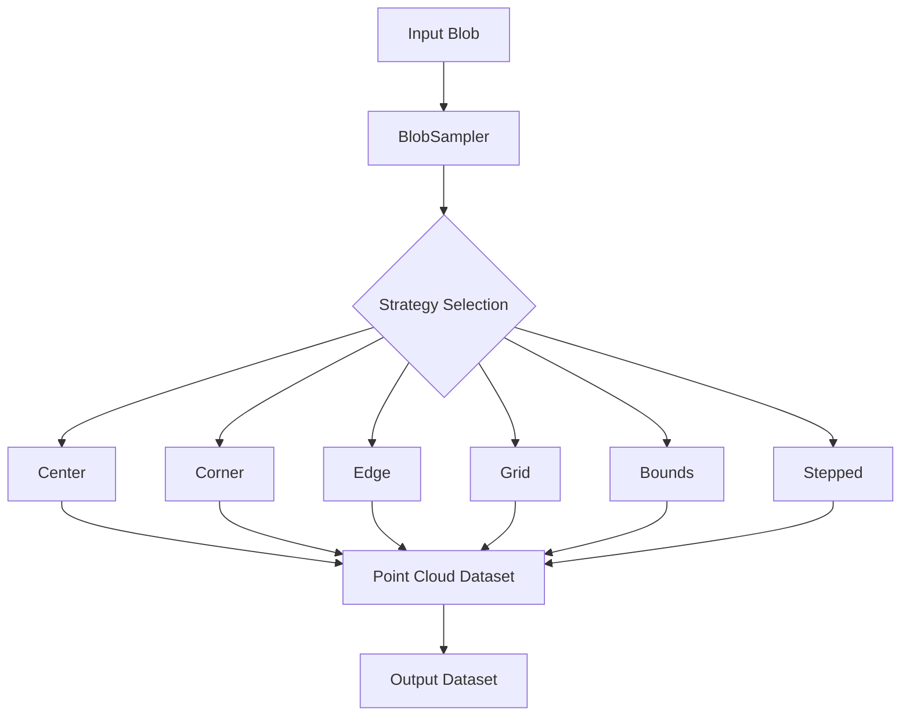

# BlobSampler Class Analysis

## Overview

BlobSampler is a class designed to sample points from blob-like structures in a wire chamber detector, producing point cloud representations. It's part of the Wire-Cell toolkit and implements multiple sampling strategies to convert detector blobs into point clouds for further analysis.

## Class Structure

### Core Components

1. **Base Class Inheritance**
   - `Aux::Logger`: For logging functionality
   - `IBlobSampler`: Interface for blob sampling
   - `IConfigurable`: Interface for configuration

2. **Key Member Variables**
   - `CommonConfig m_cc`: Common configuration parameters
   - `std::vector<std::unique_ptr<Sampler>> m_samplers`: Collection of sampling strategies

### Common Configuration (CommonConfig)

```cpp
struct CommonConfig {
    double time_offset;         // Time offset added to blob times
    double drift_speed;         // Speed to convert time to spatial position
    std::string prefix;         // Prefix for dataset array names
    Binning tbinning;          // Time binning configuration
    std::vector<std::string> extra;    // Extra arrays to include
    std::vector<std::regex> extra_re;  // Regex patterns for extra arrays
};
```

## Sampling Strategies

The class implements six distinct sampling strategies:

1. **Center Strategy**
   - Calculates a single point at the blob's center
   - Simplest sampling method
   - Uses average of corner points

2. **Corner Strategy**
   - Samples points at each blob corner
   - Provides structural boundary information
   - Basic outline of the blob shape

3. **Edge Strategy**
   - Samples points along the edges between corners
   - Takes midpoints of each edge segment
   - Better boundary representation than corners alone

4. **Grid Strategy**
   - Creates uniform grid of points within the blob
   - Configurable step size
   - Two modes: aligned and unaligned to wire grid

5. **Bounds Strategy**
   - Samples points along blob boundaries
   - Configurable step size between points
   - More detailed boundary representation

6. **Stepped Strategy**
   - Advanced sampling based on wire crossings
   - Adapts to blob size with variable step sizes
   - Matches Wire-Cell prototype sampling

## Core Algorithms

### Point Sampling Process

1. **Initialization**
   ```cpp
   std::tuple<PointCloud::Dataset, PointCloud::Dataset> sample_blob(
       const IBlob::pointer& iblob, int blob_index)
   ```

2. **Coordinate Translation**
   - Converts time to drift distance:
   ```cpp
   double time2drift(double time) const {
       return xorig + xsign * (time + time_offset) * drift_speed;
   }
   ```

3. **Point Cloud Generation**
   - Each strategy implements its own `sample()` method
   - Points are collected in a Dataset structure
   - Common processing through `intern()` method

### Stepped Strategy Algorithm

The most sophisticated sampling strategy follows these steps:

1. Find wire planes with min/max number of wires
2. Calculate step sizes:
   ```cpp
   int nmin = std::max(min_step_size, max_step_fraction*width_min);
   int nmax = std::max(min_step_size, max_step_fraction*width_max);
   ```
3. Sample points at wire crossings with offset adjustments
4. Validate points against third wire plane

## Data Flow



## Implementation Details

### Key Methods

1. **Configuration**
   ```cpp
   void configure(const WireCell::Configuration& cfg);
   Configuration default_configuration() const;
   ```

2. **Strategy Addition**
   ```cpp
   void add_strategy(Configuration strategy)
   ```

3. **Point Processing**
   ```cpp
   void intern(Dataset& ds, std::vector<Point> points)
   ```

### Error Handling

- Null blob check:
  ```cpp
  if (!iblob) {
      THROW(ValueError() << errmsg{"can not sample null blob"});
  }
  ```

- Invalid configuration checks
- Boundary validation
- Wire plane coordinate validation

## Usage Considerations

1. **Performance Optimization**
   - Cached wire indices for faster lookup
   - Efficient point cloud data structure
   - Minimized memory allocation

2. **Configuration Flexibility**
   - Multiple strategy combinations
   - Customizable sampling parameters
   - Extensible design for new strategies

3. **Quality Control**
   - Validation of sampling points
   - Boundary checking
   - Wire plane alignment verification

## Common Workflows

1. Basic Blob Sampling:
```cpp
BlobSampler sampler;
sampler.configure(config);
auto [dataset, aux] = sampler.sample_blob(blob, index);
```

2. Multiple Strategy Setup:
```cpp
Configuration cfg;
cfg["strategy"] = Json::arrayValue;
cfg["strategy"].append("center");
cfg["strategy"].append("stepped");
sampler.configure(cfg);
```


Let me create a visual representation of the BlobSampler's sampling strategies:


```svg
<svg viewBox="0 0 800 400" xmlns="http://www.w3.org/2000/svg">
    <!-- Background -->
    <rect width="800" height="400" fill="#f8f9fa"/>
    
    <!-- Title -->
    <text x="400" y="30" text-anchor="middle" font-size="20" fill="#333">BlobSampler Sampling Strategies</text>
    
    <!-- Original Blob Shape (repeated for each strategy) -->
    <g id="blob-shape">
        <path d="M 20 20 L 120 40 L 140 100 L 80 130 L 30 90 Z" fill="none" stroke="#ccc" stroke-width="1"/>
    </g>
    
    <!-- Center Strategy -->
    <g transform="translate(50,80)">
        <use href="#blob-shape"/>
        <circle cx="80" cy="75" r="4" fill="red"/>
        <text x="70" y="160" text-anchor="middle">Center</text>
    </g>
    
    <!-- Corner Strategy -->
    <g transform="translate(200,80)">
        <use href="#blob-shape"/>
        <circle cx="20" cy="20" r="4" fill="blue"/>
        <circle cx="120" cy="40" r="4" fill="blue"/>
        <circle cx="140" cy="100" r="4" fill="blue"/>
        <circle cx="80" cy="130" r="4" fill="blue"/>
        <circle cx="30" cy="90" r="4" fill="blue"/>
        <text x="70" y="160" text-anchor="middle">Corner</text>
    </g>
    
    <!-- Edge Strategy -->
    <g transform="translate(350,80)">
        <use href="#blob-shape"/>
        <circle cx="70" cy="30" r="4" fill="green"/>
        <circle cx="130" cy="70" r="4" fill="green"/>
        <circle cx="110" cy="115" r="4" fill="green"/>
        <circle cx="55" cy="110" r="4" fill="green"/>
        <circle cx="25" cy="55" r="4" fill="green"/>
        <text x="70" y="160" text-anchor="middle">Edge</text>
    </g>
    
    <!-- Grid Strategy -->
    <g transform="translate(500,80)">
        <use href="#blob-shape"/>
        <g fill="purple">
            <circle cx="40" cy="40" r="3"/>
            <circle cx="80" cy="40" r="3"/>
            <circle cx="120" cy="40" r="3"/>
            <circle cx="40" cy="80" r="3"/>
            <circle cx="80" cy="80" r="3"/>
            <circle cx="120" cy="80" r="3"/>
            <circle cx="40" cy="120" r="3"/>
            <circle cx="80" cy="120" r="3"/>
            <circle cx="120" cy="120" r="3"/>
        </g>
        <text x="70" y="160" text-anchor="middle">Grid</text>
    </g>
    
    <!-- Bounds Strategy -->
    <g transform="translate(650,80)">
        <use href="#blob-shape"/>
        <g fill="orange">
            <circle cx="50" cy="27" r="3"/>
            <circle cx="90" cy="35" r="3"/>
            <circle cx="127" cy="60" r="3"/>
            <circle cx="137" cy="85" r="3"/>
            <circle cx="120" cy="110" r="3"/>
            <circle cx="95" cy="125" r="3"/>
            <circle cx="65" cy="120" r="3"/>
            <circle cx="45" cy="105" r="3"/>
            <circle cx="32" cy="70" r="3"/>
            <circle cx="25" cy="45" r="3"/>
        </g>
        <text x="70" y="160" text-anchor="middle">Bounds</text>
    </g>
    
    <!-- Stepped Strategy -->
    <g transform="translate(275,250)">
        <use href="#blob-shape"/>
        <!-- Wire grid background -->
        <g stroke="#eee" stroke-width="0.5">
            <line x1="0" y1="20" x2="150" y2="20"/>
            <line x1="0" y1="40" x2="150" y2="40"/>
            <line x1="0" y1="60" x2="150" y2="60"/>
            <line x1="0" y1="80" x2="150" y2="80"/>
            <line x1="0" y1="100" x2="150" y2="100"/>
            <line x1="0" y1="120" x2="150" y2="120"/>
        </g>
        <!-- Sampled points -->
        <g fill="#ff1493">
            <circle cx="40" cy="40" r="3"/>
            <circle cx="80" cy="40" r="3"/>
            <circle cx="40" cy="80" r="3"/>
            <circle cx="80" cy="80" r="3"/>
            <circle cx="120" cy="80" r="3"/>
        </g>
        <text x="70" y="160" text-anchor="middle">Stepped</text>
    </g>
    
    <!-- Legend -->
    <g transform="translate(550,250)">
        <rect width="200" height="120" fill="white" stroke="#ccc"/>
        <text x="10" y="20" font-size="12">Strategy Properties:</text>
        <circle cx="20" cy="40" r="4" fill="red"/>
        <text x="35" y="43" font-size="10">Center: Single point</text>
        <circle cx="20" cy="60" r="4" fill="blue"/>
        <text x="35" y="63" font-size="10">Corner: Vertex points</text>
        <circle cx="20" cy="80" r="4" fill="green"/>
        <text x="35" y="83" font-size="10">Edge: Midpoint samples</text>
        <circle cx="20" cy="100" r="4" fill="purple"/>
        <text x="35" y="103" font-size="10">Grid: Regular spacing</text>
        <circle cx="20" cy="120" r="4" fill="#ff1493"/>
        <text x="35" y="123" font-size="10">Stepped: Wire-aligned</text>
    </g>
</svg>

```

The BlobSampler class is a sophisticated component for sampling points from detector blobs in different ways. Here are the key points to understand:

1. **Purpose**: 
   - Converts detector blob data into point cloud representations
   - Supports multiple sampling strategies for different analysis needs
   - Handles time/drift coordinate transformations

2. **Configuration System**:
   - Flexible configuration through JSON
   - Common parameters like drift speed and time offset
   - Strategy-specific parameters

3. **Sampling Strategies**:
   Each strategy serves a different purpose:
   - Center: Quick blob position identification
   - Corner: Basic shape outline
   - Edge: Better boundary definition
   - Grid: Uniform internal sampling
   - Bounds: Detailed boundary sampling
   - Stepped: Wire-crossing aligned sampling

4. **Key Features**:
   - Thread-safe design (except for channel cache)
   - Efficient point cloud generation
   - Comprehensive error checking
   - Extensible strategy system

5. **Usage Pattern**:
```cpp
// Configure sampler
BlobSampler sampler;
Configuration cfg;
cfg["strategy"] = "stepped";  // or array of strategies
cfg["drift_speed"] = 1.6;     // mm/μs
sampler.configure(cfg);

// Sample blob
auto [dataset, aux] = sampler.sample_blob(blob, index);
```

The visualization above shows how each strategy samples points differently from the same blob shape. The Stepped strategy is particularly important as it aligns with the wire chamber geometry.

