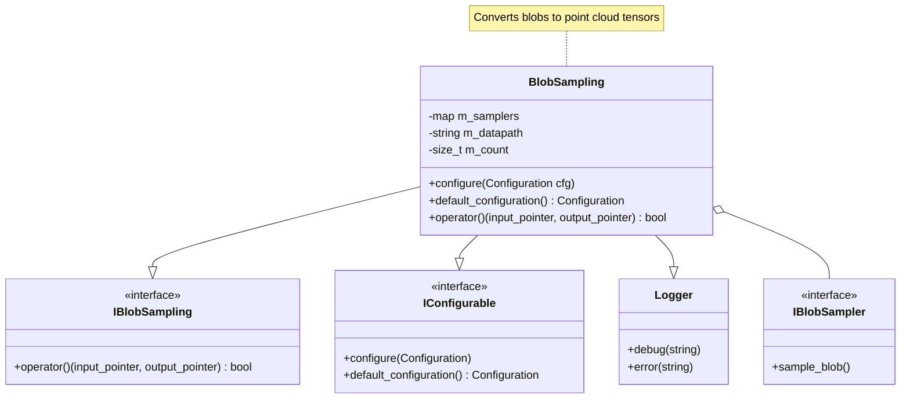

# BlobSampling Class Analysis

## Class Overview
BlobSampling is a Wire-Cell Toolkit class that transforms blob data into point cloud trees and outputs them as tensors. It implements multiple interfaces:
- `IBlobSampling`: Core blob sampling functionality
- `IConfigurable`: Configuration management
- `INamed`: Named component interface
- Inherits from `Aux::Logger` for logging capabilities

## Core Components

### 1. Member Variables
- `m_samplers`: Map of sampler name to IBlobSampler pointer
- `m_datapath`: String template for output data path (default: "pointtrees/%d")
- `m_count`: Operation counter for logging

### 2. Configuration System

#### Configuration Parameters
```json
{
    "datapath": "pointtrees/%d",  // Output path template
    "samplers": {                 // Map of sampler configurations
        "<name>": "<type/name>"   // Name -> sampler type mapping
    }
}
```

#### Configuration Logic
1. Sets datapath from config or uses default
2. Validates samplers configuration exists
3. For each sampler entry:
   - Extracts name and type
   - Validates non-empty type
   - Creates sampler instance via Factory system
   - Stores in m_samplers map

### 3. Primary Algorithm (operator())

The main processing algorithm follows these steps:

1. Input Validation:
   - Accepts IBlobSet input pointer
   - Returns true with null output for end-of-stream (EOS)
   - Extracts blobs from input blobset

2. Point Cloud Generation:
   - Creates root node for point tree
   - Iterates through each blob:
     - Skips null blobs
     - For each configured sampler:
       - Samples blob to create point cloud
       - Associates point cloud with sampler name
     - Inserts resulting named point clouds into tree

3. Tensor Creation:
   - Formats output datapath using blobset identifier
   - Converts point tree to tensors
   - Creates tensor set with blobset identifier
   - Returns tensor set via output parameter

## Key Features

1. **Multi-Sampler Support**
   - Supports multiple sampling strategies simultaneously
   - Each sampler produces differently named point clouds
   - Results combined in single point cloud tree

2. **Configurable Output Path**
   - Supports templated paths with %d formatter
   - Interpolates blobset identifier into path

3. **Robust Error Handling**
   - Validates configuration
   - Handles null inputs
   - Skips invalid blobs
   - Includes detailed logging

4. **Factory Integration**
   - Implements WIRECELL_FACTORY macro
   - Supports dynamic sampler creation
   - Integrates with Wire-Cell component system

## Usage Patterns

1. Configuration:
```python
config = {
    "datapath": "output/points/%d",
    "samplers": {
        "charge": "ChargeSpaceSampler",
        "time": "TimeSpaceSampler"
    }
}
sampler.configure(config)
```

2. Processing:
```cpp
IBlobSet::pointer input = /* blob set */;
ITensorSet::pointer output;
bool more = sampler(input, output);
```

## Performance Considerations

1. Memory Management:
   - Uses smart pointers for safety
   - Creates point tree structure efficiently
   - Manages tensor conversion in-place

2. Processing Efficiency:
   - Processes blobs sequentially
   - Allows parallel sampling strategies
   - Minimizes data copying

3. Scalability:
   - Handles variable blob counts
   - Supports multiple sampling strategies
   - Flexible output path management




The BlobSampling class is a complex component in the Wire-Cell Toolkit that serves as a bridge between blob-based data structures and tensor-based output formats. I've provided a detailed analysis of its structure and operation in the first artifact, and a visual representation of its class relationships in the second artifact.

Key points to highlight that weren't covered in detail in the artifacts:

1. The class uses the Wire-Cell factory system for dependency injection, allowing for runtime configuration of different sampling strategies.

2. The logging system is integrated throughout the code to provide detailed debugging information, which is crucial for monitoring the sampling process.

3. The design allows for extensibility through the sampler system - new sampling strategies can be added without modifying the core BlobSampling class.

