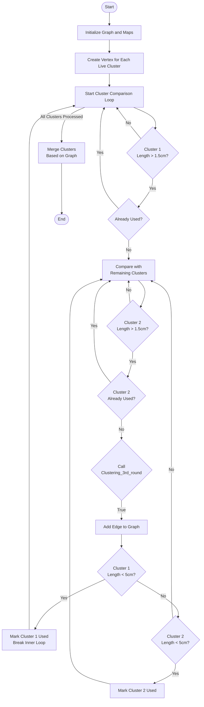
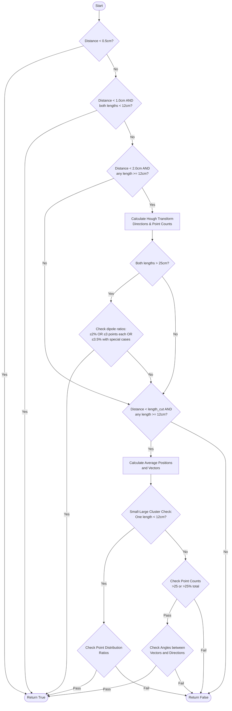

I'll analyze the clustering_close function and explain its logic and algorithm.





# clustering_close Algorithm Analysis

## Purpose
The `clustering_close` function implements a graph-based clustering algorithm to merge nearby clusters based on their geometric properties. It uses the `Clustering_3rd_round` function as its core decision maker for whether clusters should be connected.

## Algorithm Components

### 1. Data Structures
- **Graph (g)**: Boost undirected graph to represent cluster connectivity
- **Map (ilive2desc)**: Maps cluster indices to graph vertex descriptors
- **Map (map_cluster_index)**: Maps Cluster pointers to their indices
- **Set (used_clusters)**: Tracks clusters that have been processed and marked as used

### 2. Graph Construction Phase

#### Initial Setup
```cpp
Graph g;
std::unordered_map<int, int> ilive2desc;
std::map<const Cluster*, int> map_cluster_index;
```

#### Vertex Creation
- Creates vertices for each live cluster
- Assigns indices and maintains mappings for later reference

### 3. Edge Creation Process

#### Cluster Selection Criteria
1. **Primary Length Filter**
   - Both clusters must be longer than 1.5cm
   - Prevents very small clusters from being considered

2. **Usage Status Check**
   - Skips clusters already marked as "used"
   - Helps prevent over-clustering

#### Connection Logic
1. **Proximity Test**
   - Uses `Clustering_3rd_round` to determine if clusters should be connected
   - Considers:
     - Distance between clusters
     - Geometric alignment
     - Point distribution patterns

2. **Small Cluster Handling**
   - Special processing for clusters < 5cm
   - Once connected, these small clusters are marked as "used"
   - Prevents them from forming multiple connections

### 4. Graph Edge Addition
When clusters are determined to be connected:
1. Adds edge between corresponding vertices in the graph
2. Updates usage status based on cluster sizes
3. May break inner loop for small clusters

### 5. Final Merging Phase
- Calls `merge_clusters` function to:
  - Process the constructed graph
  - Combine connected clusters
  - Update the cluster set

## Implementation Details

### Key Parameters
- **length_cut**: Distance threshold for considering cluster connections
- **1.5cm**: Minimum cluster length for consideration
- **5cm**: Threshold for special handling of small clusters

### Efficiency Considerations
1. **Early Filtering**
   - Length checks before expensive computations
   - Usage status checks to prevent redundant processing

2. **Loop Structure**
   - Nested loop for comparing all cluster pairs
   - Break conditions for small clusters to reduce comparisons

3. **Memory Management**
   - Uses references where possible
   - Maintains maps for efficient lookups

### Safety Features
1. **Used Cluster Tracking**
   - Prevents over-clustering
   - Ensures small clusters don't form too many connections

2. **Size-based Processing**
   - Different handling for different cluster sizes
   - Protects small clusters from excessive merging

## Interaction with Other Components

### Input
- **live_grouping**: Contains the clusters to be processed
- **cluster_connected_dead**: Set of clusters connected to dead channels
- **length_cut**: Distance threshold parameter

### Output
- Modified cluster connections in the input grouping
- Updated cluster_connected_dead set

### Dependencies
- Relies on `Clustering_3rd_round` for connection decisions
- Uses `merge_clusters` for final cluster combination


The `clustering_close` function implements a graph-based clustering algorithm. Here are the key points:

1. **Algorithm Structure**:
   - Uses a graph representation where:
     - Vertices represent clusters
     - Edges represent connections between clusters
   - Implements a two-phase process:
     - Graph construction with connection logic
     - Final merging based on graph connectivity

2. **Key Features**:
   - Filters out clusters smaller than 1.5cm
   - Special handling for clusters under 5cm
   - Uses `Clustering_3rd_round` for connection decisions
   - Maintains a "used clusters" set to prevent over-clustering

3. **Efficiency Considerations**:
   - Early filtering to avoid unnecessary computations
   - Break conditions for small clusters
   - Efficient data structures for lookups

4. **Safety Mechanisms**:
   - Length thresholds to filter inappropriate clusters
   - Usage tracking to prevent excessive connections
   - Size-based processing rules

The function is particularly interesting in how it:
- Uses a graph structure to represent cluster relationships
- Implements different rules based on cluster sizes
- Prevents over-clustering through usage tracking
- Combines geometric and topological approaches


Let me analyze the Clustering_3rd_round function and explain its logic and algorithm.





# Clustering_3rd_round Algorithm Analysis

## Purpose
The function determines whether two clusters should be merged based on their geometric properties, primarily considering:
- Distance between closest points
- Cluster lengths
- Point distributions
- Directional alignment

## Core Decision Logic

### 1. Quick Merge Conditions
The algorithm first checks for immediate merge conditions:
- If distance < 0.5cm: Merge immediately
- If distance < 1.0cm AND both clusters < 12cm: Merge immediately

### 2. Medium Distance Analysis (< 2.0cm)
For clusters where at least one is ≥ 12cm:
- Performs Hough transform to determine cluster directions
- Counts points using dipole method
- For large clusters (> 25cm), checks specific dipole ratios:
  - Both clusters must have ratio < 2% OR ≤ 3 points
  - OR special case with 3.5% threshold and additional constraints

### 3. Extended Analysis (< length_cut)
For more distant clusters where at least one is ≥ 12cm:

#### Small-Large Cluster Interaction
- Special handling when one cluster < 12cm:
  - Small cluster must have > 50% points near connection
  - Large cluster must have significant point density

#### Large Cluster Interaction
When both clusters are larger:
1. Checks point density requirements:
   - > 25 points or > 25% of total points
2. Performs angle analysis:
   - Between cluster directions
   - Between directions and connection vector
   - Uses both local (near connection) and global directions

## Key Metrics Used

### Length-based Classification
- Very small: < 12cm
- Medium: 12-25cm
- Large: 25-60cm
- Very large: > 60cm

### Point Distribution Metrics
- Nearby points (within 10cm)
- Total points in cluster
- Dipole distribution (points on either side of connection)

### Angular Measurements
- Direction vectors from Hough transform
- Angles between:
  - Cluster directions
  - Connection vector
  - Average position vectors

## Implementation Notes

1. The algorithm uses multiple geometric calculations:
   - Closest point finding
   - Hough transforms for direction
   - Point counting in regions
   - Vector angle calculations

2. Different thresholds are applied based on cluster sizes:
   - Stricter conditions for very large clusters
   - More lenient conditions for small clusters
   - Special handling for small-large cluster pairs

3. The code includes multiple safety checks to prevent inappropriate merging:
   - Point density requirements
   - Directional alignment constraints
   - Size-dependent threshold adjustments


The Clustering_3rd_round function implements a sophisticated clustering algorithm that decides whether two clusters should be merged based on various geometric and point distribution properties. I've created two artifacts that explain the algorithm:

1. A flowchart showing the decision tree structure
2. A detailed markdown document explaining the algorithm's components and logic

The key aspects of the algorithm are:

1. It uses a hierarchical decision process, starting with simple distance checks and progressing to more complex geometric analyses.

2. The behavior varies significantly based on cluster sizes:
   - Very close clusters (< 0.5cm) are merged immediately
   - Small clusters (< 12cm) have special handling rules
   - Large clusters (> 25cm) require more stringent alignment checks

3. The algorithm employs multiple geometric tools:
   - Hough transforms for direction finding
   - Point density analysis
   - Vector angle calculations
   - Dipole distribution analysis

