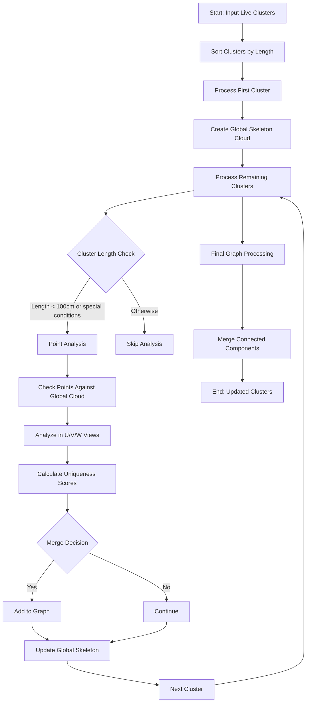

The flow diagram shows the high-level process, while the detailed explanation covers the specific algorithms and criteria used at each step. 





# Clustering Connect Algorithm Detailed Explanation

## Overview
The `clustering_connect1` function implements a sophisticated clustering algorithm for connecting track segments in a 3D particle detector. It uses geometric and topological properties to determine which clusters should be merged.

## Key Components

### 1. Data Structures
- **Live Grouping**: Collection of current clusters
- **Global Point Cloud**: Reference point cloud for spatial comparisons
- **Dead Wire Maps**: Maps containing dead wire regions for U/V/W views
- **Boost Graph**: Used to track cluster connectivity for merging

### 2. Direction Vectors
The algorithm uses several important direction vectors:
- **drift_dir**: (1,0,0) - Drift direction
- **U_dir**: (0, cos(60°), sin(60°)) - U wire direction
- **V_dir**: (0, cos(60°), -sin(60°)) - V wire direction
- **W_dir**: (0, 1, 0) - W wire direction

## Algorithm Steps

### Phase 1: Initialization
1. Sort clusters by length in descending order
2. Create empty global skeleton cloud
3. Initialize variables:
   - extending_dis = 50 cm
   - angle = 7.5°
   - loose_dis_cut = 7.5 cm

### Phase 2: First Cluster Processing
1. Process the longest cluster first
2. Calculate extreme points and directions
3. Add points to global skeleton cloud in both directions

### Phase 3: Remaining Clusters Processing
For each subsequent cluster:

1. **Length Filter**:
   - Process if length < 100 cm
   - Or if special parallel conditions are met

2. **Direction Analysis**:
   ```cpp
   Calculate main_dir from extreme points
   Calculate dir1 and dir2 using:
   - Direct calculation for long segments
   - Hough transform for shorter segments
   ```

3. **Point Analysis**:
   - Check each point against global skeleton
   - Analyze in U, V, W views separately
   - Track unique points and overlapping regions

4. **Merge Decision Criteria**:
   a) Primary Overlap Check:
   ```cpp
   if (overlap_points > 75% of total points &&
       unique_points < 24% of total points)
   ```

   b) Secondary Geometric Check:
   ```cpp
   if (angle_difference > 70° &&
       distance < specified_threshold)
   ```

   c) PCA-based Analysis:
   ```cpp
   if (significant_overlap &&
       PCA_directions_aligned &&
       distance < threshold)
   ```

### Phase 4: Graph Processing
1. Build connectivity graph based on merge decisions
2. Process graph to identify connected components
3. Merge clusters within each connected component

### Phase 5: Secondary Pass
1. Perform additional connectivity analysis
2. Apply stricter geometric criteria
3. Create final cluster groupings

## Key Algorithms

### Direction Calculation
```cpp
if (main_dir.magnitude() > 10 cm && 
    abs(main_dir.angle(drift_dir) - 90°) < 5°) {
    // Use direct calculation
} else if (cluster->get_length() > 25 cm) {
    // Use cluster-based Hough transform
} else {
    // Use global point cloud Hough transform
}
```

### Merge Criteria
The algorithm uses multiple layers of criteria:
1. Spatial proximity
2. Directional alignment
3. Point overlap percentage
4. PCA-based geometric alignment

### Distance Calculations
- Point-to-cluster distance
- Cluster-to-cluster minimum distance
- Directional alignment angles

## Important Parameters

1. **Length Thresholds**:
   - Primary length cut: 100 cm
   - Secondary length cut: 25 cm
   - Minimum length: 3 cm

2. **Angular Thresholds**:
   - Basic angle: 7.5°
   - Parallel threshold: 5°
   - Merge angle threshold: 70°

3. **Distance Thresholds**:
   - Extension distance: 50 cm
   - Loose distance cut: 7.5 cm
   - Merge distance thresholds: 1.2-4.0 cm

## Error Handling

The algorithm includes several safeguards:
1. Dead wire region handling
2. Length-based filtering
3. Multiple validation steps before merging
4. Graph-based connectivity validation

## Performance Considerations

1. **Optimization Techniques**:
   - Early filtering of small clusters
   - Use of spatial indexing in point cloud
   - Efficient graph-based merging

2. **Memory Management**:
   - Point cloud structure for spatial queries
   - Efficient graph representation
   - Smart pointers for resource management


This clustering algorithm is designed to connect track segments in a 3D particle detector, specifically focusing on handling complex geometries and noise. The algorithm works in multiple phases, starting with the longest clusters and progressively processing smaller ones while maintaining a global view of the detector space.

The key innovation is its multi-view approach, analyzing clusters in the U, V, and W wire planes while accounting for dead regions in each view. It uses a combination of geometric properties (angles, distances) and topological features (point overlaps, connectivity) to make merging decisions.

The algorithm is particularly robust because it:
1. Handles dead wire regions explicitly
2. Uses multiple geometric criteria for validation
3. Employs both local and global analyses
4. Implements a two-pass approach for better accuracy

