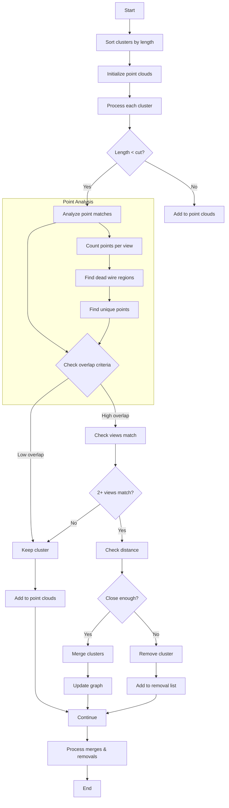

I'll explain the clustering_deghost function's logic and algorithm in detail. This function appears to be a ghost track removal algorithm for particle tracking detectors.




Here's a detailed explanation of the algorithm:

1. Purpose:
- The function aims to identify and remove ghost tracks (false tracks) by analyzing the consistency of track projections across three wire planes (U, V, W views)
- It also handles cases where some wires are dead (non-functioning)

2. Key Components:
- Two point clouds are maintained:
  - global_point_cloud: Stores all points from valid tracks
  - global_skeleton_cloud: Stores simplified representations of longer tracks (>30cm)
- A connectivity graph (g) to track which clusters should be merged
- Maps of dead wire regions for each view (dead_u_index, dead_v_index, dead_w_index)

3. Main Algorithm Steps:

a) Initialization:
```cpp
- Sort clusters by length (descending order)
- Create empty point clouds for tracking points and skeletons
- Initialize graph structures for cluster merging
```

b) For each cluster:

- If cluster length > length_cut:
  - Add directly to point clouds
  - If length > 30cm, construct skeleton

- If cluster length ≤ length_cut:
  - Analyze points in each view:
    - Count total points
    - Identify points in dead regions
    - Find points matching existing clusters
    - Count unique points (no matches)

c) Decision Criteria:
```cpp
- Primary criteria for ghost identification:
  - Low unique point count (≤10% per view)
  - High point overlap with existing clusters
  - Consistent matches across at least 2 views
  - Physical proximity (<20cm) to matched cluster
```

4. Key Thresholds:
- Distance cuts:
  - Close point matching: 1.2cm/3
  - Skeleton matching: 2.4cm
  - Cluster merging distance: 20cm
- Overlap criteria:
  - Point matching: 80% in primary views
  - Secondary view: 65% match
- Uniqueness thresholds:
  - Per view: ≤10% unique points
  - Total: ≤5% unique points across views

5. Actions:
- For identified ghosts:
  - If close to matching cluster: Merge clusters
  - Otherwise: Remove cluster
- For valid clusters:
  - Add to point clouds
  - Create skeleton if long enough

6. Final Processing:
- Execute cluster merges based on graph connectivity
- Remove identified ghost clusters
- Update cluster grouping structure

The algorithm is particularly sophisticated in how it:
- Handles dead wire regions
- Uses multi-view consistency checks
- Combines both point-by-point and skeleton-based matching
- Applies different criteria based on cluster length
- Uses a hierarchical decision process for ghost identification

This deghosting is crucial for improving track reconstruction quality in particle detectors by removing false tracks that can arise from ambiguous wire crossings or detector noise.

