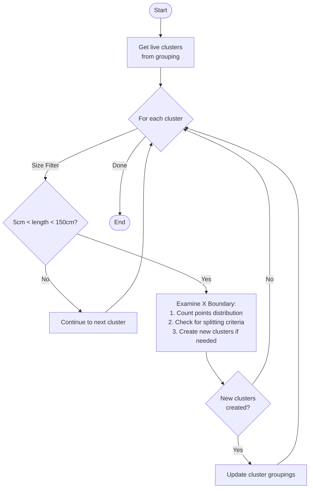
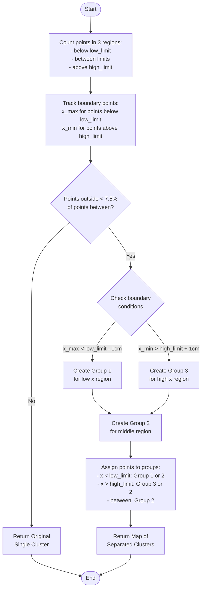

I'll explain the `clustering_examine_x_boundary` function which applies the x-boundary examination across a group of clusters.



Here's the detailed breakdown of the algorithm:

1. Cluster Selection and Filtering:
```cpp
// Get vector of current clusters
std::vector<Cluster *> live_clusters = live_grouping.children();

// Only examine clusters within specific length bounds
for (size_t i = 0; i != live_clusters.size(); i++) {
    Cluster *cluster = live_clusters.at(i);
    if (cluster->get_length() > 5 * units::cm && 
        cluster->get_length() < 150 * units::cm) {
        // Process cluster...
    }
}
```

2. Key Characteristics:
- Works on a collection of clusters in a `Grouping` object
- Only processes clusters between 5cm and 150cm in length
- Uses the individual `examine_x_boundary` function we discussed earlier for each qualifying cluster

3. Process Flow:
   - Gets all current clusters from the grouping
   - For each cluster:
     - Checks if it meets the size criteria (5-150cm)
     - If it qualifies, examines its x-boundary distribution
     - May split the cluster based on x-coordinate boundaries
   - Updates the grouping with any new clusters created

4. Implementation Details:
```cpp
void clustering_examine_x_boundary(
    Grouping& live_grouping,      // Collection of clusters to examine
    const double low_limit,       // Lower x-coordinate boundary
    const double high_limit       // Upper x-coordinate boundary
) {
    std::vector<Cluster *> live_clusters = live_grouping.children();
    
    for (size_t i = 0; i != live_clusters.size(); i++) {
        Cluster *cluster = live_clusters.at(i);
        
        // Size filter
        if (cluster->get_length() > 5 * units::cm && 
            cluster->get_length() < 150 * units::cm) {
            
            // Examine and potentially split cluster
            std::unordered_map<int, Cluster*> id2clusters = 
                cluster->examine_x_boundary(low_limit, high_limit);
            
            // Further processing of split clusters would happen here
            // (though currently commented out in the source)
        }
    }
}
```

5. Important Parameters:
- `live_grouping`: The collection of clusters to examine
- `low_limit`: The lower x-coordinate boundary for analysis
- `high_limit`: The upper x-coordinate boundary for analysis

6. Key Features:
- Operates at the grouping level rather than individual cluster level
- Provides batch processing of multiple clusters
- Maintains size-based filtering to focus on relevant clusters
- Preserves the group structure while allowing for cluster splits

7. Usage Context:
This function is typically used in larger clustering systems where:
- You need to analyze and potentially split multiple clusters based on x-coordinate distribution
- The clusters represent physical detector data that might span multiple regions
- You want to maintain clean boundaries between different detector regions
- You need to handle multiple clusters efficiently in a batch process

8. Considerations:
- The function focuses on clusters of moderate size (5-150cm)
- Very small or very large clusters are skipped
- The actual splitting logic is handled by the individual `examine_x_boundary` function
- The function preserves the overall grouping structure while allowing for cluster modifications

This clustering function serves as a higher-level manager for the x-boundary examination process, applying the individual cluster examination across a collection of clusters while maintaining appropriate size filters and grouping structures. It's particularly useful in particle physics applications where understanding and maintaining proper spatial boundaries is crucial for accurate event reconstruction.


Let me explain the `examine_x_boundary` function which appears to be used for analyzing and potentially splitting clusters based on x-coordinate boundaries.



The flowchart now better matches the actual algorithm implementation and makes the decision process more clear to understand.

The algorithm's main purpose is to examine if a cluster should be split based on its distribution across x-coordinate boundaries. Here's the detailed breakdown:

1. Point Distribution Analysis:
- The function takes two parameters: `low_limit` and `high_limit` defining x-coordinate boundaries
- It counts points in three regions:
  - Below low_limit (num_points[0])
  - Between limits (num_points[1]) 
  - Above high_limit (num_points[2])
- Tracks maximum x value for points below low_limit (x_max)
- Tracks minimum x value for points above high_limit (x_min)

2. Decision Making:
- The main criterion is: `num_points[0] + num_points[2] < num_points[1] * 0.075`
  - This checks if the total points outside boundaries are less than 7.5% of points between boundaries
  - If true, the cluster is a candidate for splitting

3. Boundary Analysis:
- If x_max is significantly below low_limit (< low_limit - 1cm), creates Group 1
- If x_min is significantly above high_limit (> high_limit + 1cm), creates Group 3
- Always creates Group 2 for the middle region if any splitting occurs

4. Point Assignment:
- For each measurement cell (blob):
  - If x < low_limit: assigns to Group 1 (if exists) or Group 2
  - If x > high_limit: assigns to Group 3 (if exists) or Group 2
  - Otherwise: assigns to Group 2

5. Result:
- Returns a map of group IDs to new clusters if splitting occurred
- Otherwise, maintains original cluster structure

The key implementation can be highlighted in this code excerpt:


```cpp
// Checking if points outside boundaries are less than 7.5% of points between boundaries
if (num_points[0] + num_points[2] < num_points[1] * 0.075) {
    // Initialize potential groups
    std::set<int> groupids;
    
    // Check if need group 1 (low x boundary)
    if (x_max < low_limit - 1.0 * units::cm && x_max > -1e8) {
        groupids.insert(1);
    }
    
    // Check if need group 3 (high x boundary)
    if (x_min > high_limit + 1.0 * units::cm && x_min < 1e8) {
        groupids.insert(3);
    }
    
    // If any boundary groups needed, create middle group and assign points
    if (!groupids.empty()) {
        groupids.insert(2);  // Middle group
        
        // Assign each blob to appropriate group
        for (size_t idx=0; idx < mcells.size(); idx++) {
            Blob *mcell = mcells.at(idx);
            if (mcell->points()[0].x() < low_limit) {
                // Assign to group 1 if it exists, otherwise group 2
                b2groupid[idx] = (groupids.find(1) != groupids.end()) ? 1 : 2;
            }
            else if (mcell->points()[0].x() > high_limit) {
                // Assign to group 3 if it exists, otherwise group 2
                b2groupid[idx] = (groupids.find(3) != groupids.end()) ? 3 : 2;
            }
            else {
                // Points between boundaries go to group 2
                b2groupid[idx] = 2;
            }
        }
    }
}

```

This algorithm is particularly useful for:
1. Identifying and separating clusters that span significant x-coordinate boundaries
2. Handling cases where a small portion of points lie outside main boundaries
3. Maintaining cluster integrity when the distribution doesn't warrant splitting
4. Creating clean separations based on spatial distribution of points

The function appears to be used in a larger clustering system, likely for particle tracking or detector data analysis, where understanding the spatial distribution of points along the x-axis is crucial for proper event reconstruction.