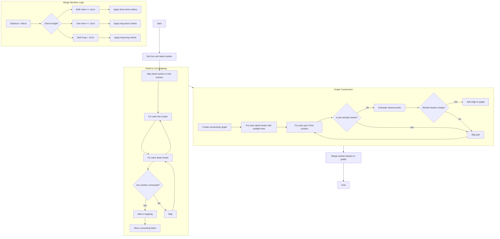

I'll create a detailed explanation of the `clustering_live_dead` function's algorithm and logic.




The `clustering_live_dead` function implements a sophisticated clustering algorithm that connects "live" clusters through their relationships with "dead" clusters. Here's a detailed breakdown of how it works:

1. **Initial Setup and Sorting**:
   - Takes live clusters, dead clusters, and parameters as input
   - Sorts both live and dead clusters for consistent processing
   - Creates data structures to map relationships between clusters

2. **Mapping Dead to Live Clusters**:
   - For each live-dead cluster pair:
     - Checks if they are connected using `is_connected()` method
     - If connected, stores the relationship and the connecting blobs
     - Creates a mapping from dead clusters to their connected live clusters

3. **Graph Construction for Merging**:
   - Creates an undirected graph where:
     - Vertices represent live clusters
     - Edges represent mergeable relationships
   - For each dead cluster with multiple connected live clusters:
     - Examines each pair of connected live clusters
     - Determines if they should be merged based on complex criteria

4. **Merge Criteria** (Key geometric checks):
   - Distance between clusters must be < 60cm
   - Analyzes cluster directions using:
     - Local direction (vhough_transform)
     - Connection direction between clusters
     - Drift direction considerations
   
5. **Length-Based Merge Rules**:
   - Different criteria based on cluster lengths:
     - Short clusters (≤ 12cm)
     - Long clusters (> 12cm)
     - Mixed length pairs
   - More stringent angle requirements for longer clusters

6. **Specific Merge Conditions**:
   ```cpp
   For short-short pairs (both ≤ 12cm):
   - Very close (≤ 3cm): Relaxed angle requirements
   - Medium distance (≤ 15cm): Stricter angle alignment
   - Far distance (≤ 60cm): Very strict angle alignment

   For long-short pairs (one > 12cm):
   - Stricter criteria for the longer cluster
   - More emphasis on direction consistency
   
   For long-long pairs (both > 12cm):
   - Most stringent angle and alignment requirements
   - Must show strong directional consistency
   ```

7. **Final Merging**:
   - Uses the constructed graph to determine final cluster groupings
   - Calls `merge_clusters()` to combine the connected clusters
   - Updates the `cluster_connected_dead` set with affected clusters

The algorithm is particularly sophisticated in how it handles:
- Parallel track detection and merging
- Different criteria based on cluster lengths
- Multiple geometric checks (distance, angle, direction)
- Protection against incorrect merging through strict validation

The code also includes extensive debug capabilities (commented out in the source) for analyzing merge decisions and cluster relationships.

Would you like me to elaborate on any specific aspect of the algorithm or create additional visualizations for particular components?