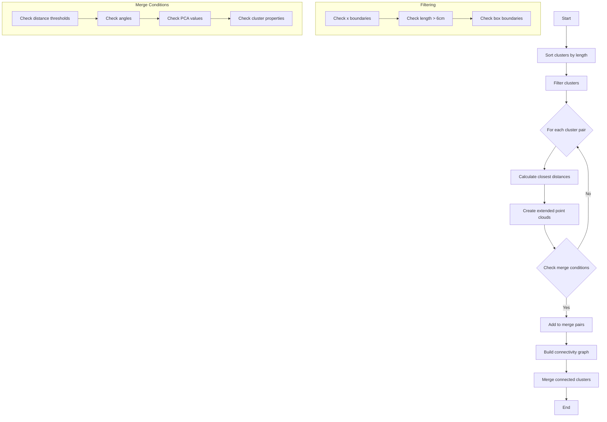

I'll analyze the clustering_neutrino function and explain its logic and algorithm in detail.




```python
def clustering_neutrino(live_grouping, num_try, low_limit, high_limit):
    """
    Algorithm to cluster neutrino-related point clouds with the following steps:
    1. Initial filtering and sorting
    2. Extended point cloud creation
    3. Merge condition checking
    4. Graph-based cluster merging
    """
    # 1. Sort and filter clusters
    clusters = sort_clusters_by_length(live_grouping.children())
    contained_clusters = []
    candidate_clusters = []
    
    for cluster in clusters:
        # Filter clusters based on boundaries
        if not (low_limit < cluster.earliest_point.x < high_limit and 
                cluster.length > 6.0 cm):
            continue
            
        # Check box boundaries (y, z coordinates)
        if check_boundary_points(cluster):
            if len(saved_boundary_points) <= 1:
                candidate_clusters.append(cluster)
                contained_clusters.append(cluster)
        else:
            contained_clusters.append(cluster)
            
    # 2. Find closest clusters
    cluster_distances = {}
    for cluster1, cluster2 in combinations(clusters, 2):
        distance = calculate_closest_distance(cluster1, cluster2)
        update_cluster_distance_map(cluster_distances, cluster1, cluster2, distance)
        
    # 3. Create extended point clouds and check merge conditions
    to_be_merged_pairs = set()
    used_clusters = set()
    
    for cluster1 in candidate_clusters:
        for cluster2 in contained_clusters:
            if cluster1 == cluster2:
                continue
                
            # Create extended point clouds if not exists
            cloud1 = get_or_create_extended_cloud(cluster1)
            cloud2 = get_or_create_extended_cloud(cluster2)
            
            # Check various merge conditions:
            # - Distance thresholds
            # - Angle between directions
            # - PCA values
            # - Cluster properties (length, points)
            if should_merge(cluster1, cluster2, cloud1, cloud2):
                if validate_merge_type(cluster1, cluster2, used_clusters):
                    to_be_merged_pairs.add((cluster1, cluster2))
                    update_used_clusters(used_clusters, cluster1, cluster2)
                    
    # 4. Build connectivity graph and merge clusters
    graph = build_connectivity_graph(to_be_merged_pairs)
    merge_clusters(graph, live_grouping)

```

The `clustering_neutrino` function implements a sophisticated clustering algorithm specifically designed for neutrino detector data. Here's a detailed explanation of its key components:

1. **Initial Sorting and Filtering**:
   - Clusters are first sorted by length in descending order
   - Each cluster must pass basic criteria:
     - X coordinates within specified limits (low_limit to high_limit)
     - Minimum length of 6 cm
     - Specific boundary conditions for y and z coordinates

2. **Extended Point Cloud Creation**:
   - For each cluster pair being considered, the algorithm creates "extended" point clouds
   - These extended clouds include:
     - Original cluster points
     - Projected points along principal directions
     - Points based on PCA (Principal Component Analysis) axes
   - The extension helps in better understanding potential connections between clusters

3. **Merge Conditions**:
   The algorithm uses several sophisticated criteria to decide if clusters should be merged:

   a) **Distance-based conditions**:
   - Close proximity between clusters (typically < 80 cm)
   - Special handling for clusters > 80 cm in length
   - Consideration of closest point distances

   b) **Directional conditions**:
   - Angle checks between cluster directions
   - Vertical direction alignment checks
   - Beam direction considerations

   c) **PCA-based conditions**:
   - Checks on PCA eigenvalues ratios
   - Special handling for clusters with specific PCA characteristics

4. **Merge Process**:
   - Uses a graph-based approach for merging
   - Builds an undirected graph where:
     - Vertices represent clusters
     - Edges represent merge relationships
   - Final merging is done using connected components of the graph

5. **Special Considerations**:
   - Handles very long tracks (> 150 cm) differently
   - Special cases for clusters near detector boundaries
   - Protection against over-clustering
   - Consideration of time slice width for temporal coherence

The algorithm is particularly sophisticated in how it handles different cluster geometries and relationships, making it suitable for neutrino detector data where tracks can have complex topologies.

Key parameters that affect the clustering:
- `num_try`: Controls number of clustering attempts
- `low_limit` and `high_limit`: Define spatial boundaries
- Various distance thresholds (e.g., 15 cm, 30 cm, etc.)
- Angular thresholds for direction checks
- PCA value ratios for shape analysis

The algorithm is designed to be robust against:
- Noise in the detector
- Track splitting
- Complex event topologies
- Detector boundary effects

