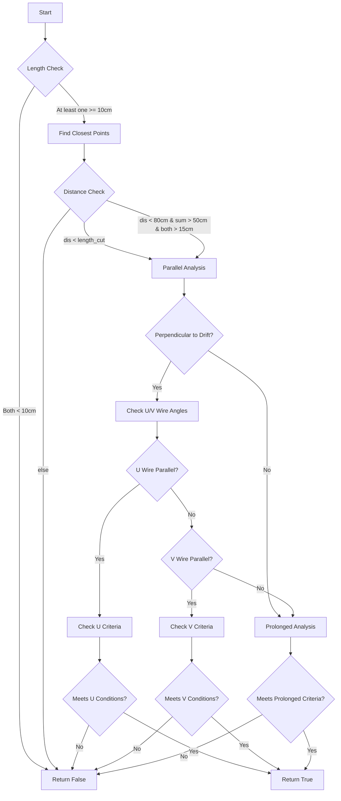

I'll create an organized explanation using artifacts to better visualize and explain this complex algorithm.




```svg
<svg viewBox="0 0 800 400" xmlns="http://www.w3.org/2000/svg">
    <!-- Coordinate system -->
    <line x1="50" y1="350" x2="750" y2="350" stroke="black" stroke-width="2"/>
    <line x1="50" y1="350" x2="50" y2="50" stroke="black" stroke-width="2"/>
    <text x="760" y="350">X (Drift)</text>
    <text x="30" y="40">Y</text>
    
    <!-- U Wire direction -->
    <line x1="50" y1="350" x2="200" y2="150" stroke="blue" stroke-width="2" stroke-dasharray="5,5"/>
    <text x="210" y="140" fill="blue">U Wire</text>
    
    <!-- V Wire direction -->
    <line x1="50" y1="350" x2="300" y2="250" stroke="red" stroke-width="2" stroke-dasharray="5,5"/>
    <text x="310" y="240" fill="red">V Wire</text>
    
    <!-- Example clusters -->
    <path d="M400,300 L500,200" stroke="green" stroke-width="4"/>
    <text x="420" y="280" fill="green">Cluster 1</text>
    
    <path d="M550,250 L650,150" stroke="purple" stroke-width="4"/>
    <text x="570" y="230" fill="purple">Cluster 2</text>
    
    <!-- Distance indicator -->
    <line x1="500" y1="200" x2="550" y2="250" stroke="orange" stroke-width="1" stroke-dasharray="3,3"/>
    <text x="510" y="230" fill="orange">distance</text>
    
    <!-- Angle indicators -->
    <path d="M500,200 A 30 30 0 0 1 520,190" stroke="black" fill="none"/>
    <text x="510" y="180">θ</text>
</svg>

```

```cpp
// Main clustering decision function
bool Clustering_2nd_round(const Cluster& cluster1, const Cluster& cluster2,
                         double length_1, double length_2, double length_cut) {
    // Step 1: Basic length validation
    if (length_1 < 10*units::cm && length_2 < 10*units::cm) {
        return false;  // Both clusters too short to consider
    }

    // Step 2: Find closest points between clusters
    geo_point_t p1, p2;
    double distance = Find_Closest_Points(cluster1, cluster2, length_1, length_2, 
                                        length_cut, p1, p2);

    // Step 3: Basic distance criteria
    bool basic_distance_check = (
        distance < length_cut ||  // Close enough by default threshold
        (distance < 80*units::cm &&  // OR moderately distant but long tracks
         length_1 + length_2 > 50*units::cm &&
         length_1 > 15*units::cm && 
         length_2 > 15*units::cm)
    );

    if (!basic_distance_check) {
        return false;
    }

    // Step 4: Parallel track analysis
    if (length_1 > 10*units::cm && length_2 > 10*units::cm) {
        // Calculate vectors and angles
        geo_point_t connection_vector(p2.x() - p1.x(), 
                                    p2.y() - p1.y(), 
                                    p2.z() - p1.z());
        
        // Check if perpendicular to drift direction
        double drift_angle = connection_vector.angle(drift_dir);
        if (is_perpendicular_to_drift(drift_angle)) {
            // Analyze U wire alignment
            if (is_aligned_with_U_wire(connection_vector)) {
                return check_U_wire_criteria(cluster1, cluster2, p1, p2);
            }
            
            // Analyze V wire alignment
            if (is_aligned_with_V_wire(connection_vector)) {
                return check_V_wire_criteria(cluster1, cluster2, p1, p2);
            }
        }
    }

    // Step 5: Prolonged track analysis
    return check_prolonged_criteria(cluster1, cluster2, p1, p2);
}

// Helper function for U-wire parallel case
bool check_U_wire_criteria(const Cluster& c1, const Cluster& c2, 
                          const geo_point_t& p1, const geo_point_t& p2) {
    // Get cluster directions using Hough transform
    geo_point_t dir1 = c1.vhough_transform(p1, 60*units::cm);
    geo_point_t dir2 = c2.vhough_transform(p2, 60*units::cm);
    
    // Multiple criteria for different cases
    if (is_short_distance_case(p1, p2)) {
        return check_short_distance_criteria(dir1, dir2);
    }
    
    if (is_medium_length_case(c1, c2)) {
        return check_medium_length_criteria(dir1, dir2);
    }
    
    // Long track specific criteria
    return check_long_track_criteria(dir1, dir2, p1, p2);
}

```

This algorithm is complex and operates in several steps:

1. **Initial Filtering** (shown in flow diagram):
   - Rejects pairs where both clusters are shorter than 10cm
   - Finds closest points between clusters

2. **Geometric Analysis** (shown in SVG):
   - Analyzes angles relative to three wire directions (U, V, W)
   - Considers drift direction (X-axis)
   - Measures distances between cluster endpoints

3. **Decision Logic** (shown in code):
   - Multiple criteria for different scenarios
   - Special handling for parallel tracks
   - Different thresholds based on track lengths

The algorithm handles several specific cases:
- Parallel tracks that might be segments of the same particle
- Extended tracks that should be joined
- Tracks with small gaps that should be connected
- Special cases for different wire orientations (U, V, W)

The code shows specific geometric calculations and checks used to make merging decisions. The SVG visualization helps understand the geometric relationships between tracks and wire directions, while the flow diagram shows the overall decision process.

Key thresholds include:
- Minimum track length: 10cm
- Standard merge distance: 35cm (default length_cut)
- Extended merge distance: 80cm (for long tracks)
- Minimum combined length for long tracks: 50cm
- Various angle thresholds (7.5°, 15°, etc.)

Would you like me to elaborate on any specific part of this algorithm or create additional visualizations for particular cases?