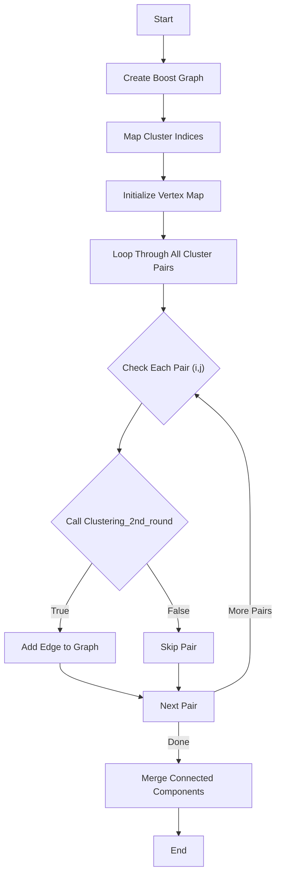
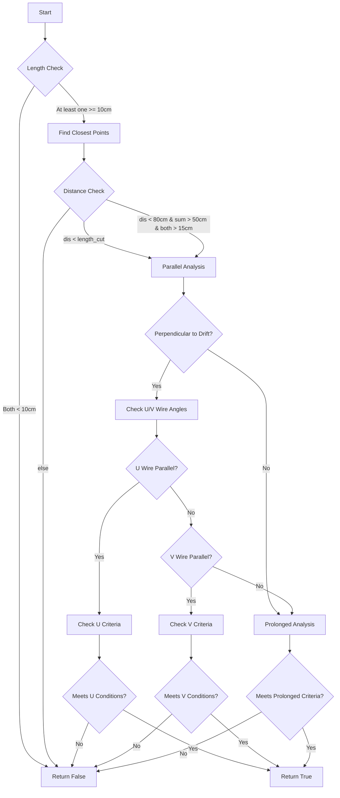

I'll explain the `clustering_parallel_prolong` function which appears to be a higher-level function for managing the parallel and prolonged track clustering process.




```svg
<svg viewBox="0 0 600 400" xmlns="http://www.w3.org/2000/svg">
    <!-- Title -->
    <text x="200" y="30" font-size="20" font-weight="bold">Cluster Graph Structure</text>
    
    <!-- Original clusters -->
    <circle cx="100" cy="100" r="20" fill="#a0d8ef"/>
    <circle cx="250" cy="100" r="20" fill="#a0d8ef"/>
    <circle cx="400" cy="100" r="20" fill="#a0d8ef"/>
    <text x="90" y="105">C1</text>
    <text x="240" y="105">C2</text>
    <text x="390" y="105">C3</text>
    
    <!-- Edges for mergeable clusters -->
    <line x1="120" y1="100" x2="230" y2="100" stroke="black" stroke-width="2"/>
    <line x1="270" y1="100" x2="380" y2="100" stroke="black" stroke-width="2"/>
    
    <!-- Connected component -->
    <path d="M 80,150 Q 250,170 420,150" stroke="#ff9999" fill="none" stroke-width="2" stroke-dasharray="5,5"/>
    <text x="200" y="200">Connected Component</text>
    
    <!-- Legend -->
    <circle cx="100" cy="300" r="15" fill="#a0d8ef"/>
    <text x="130" y="305">Cluster Vertex</text>
    <line x1="100" y1="330" x2="200" y2="330" stroke="black" stroke-width="2"/>
    <text x="230" y="335">Mergeable Connection</text>
    <path d="M 100,360 Q 150,370 200,360" stroke="#ff9999" fill="none" stroke-width="2" stroke-dasharray="5,5"/>
    <text x="230" y="365">Final Merged Group</text>
</svg>

```

```cpp
// Main clustering function for parallel and prolonged tracks
void clustering_parallel_prolong(
    Grouping& live_grouping,                    // Contains all live clusters
    cluster_set_t& cluster_connected_dead,      // Tracks connected dead clusters
    const double length_cut                     // Distance threshold for merging
) {
    // Step 1: Initialize Boost Graph
    typedef cluster_connectivity_graph_t Graph;  // Undirected graph type
    Graph g;  // Graph to track cluster connectivity
    
    // Step 2: Create mappings
    std::unordered_map<int, int> ilive2desc;    // Maps cluster index to graph vertex
    std::map<const Cluster*, int> map_cluster_index;  // Maps cluster pointer to index
    
    // Step 3: Get live clusters and create vertices
    const auto& live_clusters = live_grouping.children();
    for (size_t ilive = 0; ilive < live_clusters.size(); ++ilive) {
        const auto& live = live_clusters[ilive];
        // Create mapping from cluster to index
        map_cluster_index[live] = ilive;
        // Add vertex to graph with cluster index
        ilive2desc[ilive] = boost::add_vertex(ilive, g);
    }

    // Step 4: Build graph edges
    for (size_t i = 0; i != live_clusters.size(); i++) {
        auto cluster_1 = live_clusters.at(i);
        // Compare with all clusters after current one
        for (size_t j = i + 1; j < live_clusters.size(); j++) {
            auto cluster_2 = live_clusters.at(j);
            
            // Check if clusters should be merged using Clustering_2nd_round
            if (Clustering_2nd_round(*cluster_1, *cluster_2, 
                                   cluster_1->get_length(), 
                                   cluster_2->get_length(), 
                                   length_cut)) {
                // Add edge between mergeable clusters
                boost::add_edge(
                    ilive2desc[map_cluster_index[cluster_1]],
                    ilive2desc[map_cluster_index[cluster_2]], 
                    g
                );
            }
        }
    }

    // Step 5: Merge connected components
    merge_clusters(g, live_grouping, cluster_connected_dead);
}

```

The `clustering_parallel_prolong` function implements a graph-based clustering algorithm:

1. **Graph Initialization**
   - Creates a Boost undirected graph to represent cluster connectivity
   - Each vertex represents a cluster
   - Edges will represent mergeable cluster pairs

2. **Mapping Setup**
   - Creates two mappings:
     - `ilive2desc`: Maps cluster indices to graph vertices
     - `map_cluster_index`: Maps cluster pointers to indices
   - These mappings help maintain relationships between clusters and graph vertices

3. **Vertex Creation**
   - Iterates through all live clusters
   - Creates a vertex for each cluster in the graph
   - Establishes mappings for each cluster

4. **Edge Creation**
   - Uses nested loops to compare each pair of clusters
   - For each pair, calls `Clustering_2nd_round` to determine if they should be merged
   - If clusters should be merged, adds an edge between their vertices
   - Key criteria checked by `Clustering_2nd_round`:
     - Parallel track detection
     - Prolonged track analysis
     - Distance thresholds
     - Angular relationships

5. **Final Merging**
   - Calls `merge_clusters` to combine connected components
   - Connected components in the graph represent groups of clusters that should be merged
   - Updates both live clusters and connected dead clusters

The algorithm is efficient because:
- It only compares each pair of clusters once
- Uses graph structure to handle complex connectivity
- Maintains relationships between original clusters and graph representation

The graph-based approach allows for:
- Natural representation of cluster relationships
- Efficient handling of transitive relationships
- Easy identification of connected components for merging
- Clean separation of connectivity detection and actual merging


I'll create an organized explanation using artifacts to better visualize and explain this complex algorithm of `Clustering_2nd_round`




```svg
<svg viewBox="0 0 800 400" xmlns="http://www.w3.org/2000/svg">
    <!-- Coordinate system -->
    <line x1="50" y1="350" x2="750" y2="350" stroke="black" stroke-width="2"/>
    <line x1="50" y1="350" x2="50" y2="50" stroke="black" stroke-width="2"/>
    <text x="760" y="350">X (Drift)</text>
    <text x="30" y="40">Y</text>
    
    <!-- U Wire direction -->
    <line x1="50" y1="350" x2="200" y2="150" stroke="blue" stroke-width="2" stroke-dasharray="5,5"/>
    <text x="210" y="140" fill="blue">U Wire</text>
    
    <!-- V Wire direction -->
    <line x1="50" y1="350" x2="300" y2="250" stroke="red" stroke-width="2" stroke-dasharray="5,5"/>
    <text x="310" y="240" fill="red">V Wire</text>
    
    <!-- Example clusters -->
    <path d="M400,300 L500,200" stroke="green" stroke-width="4"/>
    <text x="420" y="280" fill="green">Cluster 1</text>
    
    <path d="M550,250 L650,150" stroke="purple" stroke-width="4"/>
    <text x="570" y="230" fill="purple">Cluster 2</text>
    
    <!-- Distance indicator -->
    <line x1="500" y1="200" x2="550" y2="250" stroke="orange" stroke-width="1" stroke-dasharray="3,3"/>
    <text x="510" y="230" fill="orange">distance</text>
    
    <!-- Angle indicators -->
    <path d="M500,200 A 30 30 0 0 1 520,190" stroke="black" fill="none"/>
    <text x="510" y="180">θ</text>
</svg>

```

```cpp
// Main clustering decision function
bool Clustering_2nd_round(const Cluster& cluster1, const Cluster& cluster2,
                         double length_1, double length_2, double length_cut) {
    // Step 1: Basic length validation
    if (length_1 < 10*units::cm && length_2 < 10*units::cm) {
        return false;  // Both clusters too short to consider
    }

    // Step 2: Find closest points between clusters
    geo_point_t p1, p2;
    double distance = Find_Closest_Points(cluster1, cluster2, length_1, length_2, 
                                        length_cut, p1, p2);

    // Step 3: Basic distance criteria
    bool basic_distance_check = (
        distance < length_cut ||  // Close enough by default threshold
        (distance < 80*units::cm &&  // OR moderately distant but long tracks
         length_1 + length_2 > 50*units::cm &&
         length_1 > 15*units::cm && 
         length_2 > 15*units::cm)
    );

    if (!basic_distance_check) {
        return false;
    }

    // Step 4: Parallel track analysis
    if (length_1 > 10*units::cm && length_2 > 10*units::cm) {
        // Calculate vectors and angles
        geo_point_t connection_vector(p2.x() - p1.x(), 
                                    p2.y() - p1.y(), 
                                    p2.z() - p1.z());
        
        // Check if perpendicular to drift direction
        double drift_angle = connection_vector.angle(drift_dir);
        if (is_perpendicular_to_drift(drift_angle)) {
            // Analyze U wire alignment
            if (is_aligned_with_U_wire(connection_vector)) {
                return check_U_wire_criteria(cluster1, cluster2, p1, p2);
            }
            
            // Analyze V wire alignment
            if (is_aligned_with_V_wire(connection_vector)) {
                return check_V_wire_criteria(cluster1, cluster2, p1, p2);
            }
        }
    }

    // Step 5: Prolonged track analysis
    return check_prolonged_criteria(cluster1, cluster2, p1, p2);
}

// Helper function for U-wire parallel case
bool check_U_wire_criteria(const Cluster& c1, const Cluster& c2, 
                          const geo_point_t& p1, const geo_point_t& p2) {
    // Get cluster directions using Hough transform
    geo_point_t dir1 = c1.vhough_transform(p1, 60*units::cm);
    geo_point_t dir2 = c2.vhough_transform(p2, 60*units::cm);
    
    // Multiple criteria for different cases
    if (is_short_distance_case(p1, p2)) {
        return check_short_distance_criteria(dir1, dir2);
    }
    
    if (is_medium_length_case(c1, c2)) {
        return check_medium_length_criteria(dir1, dir2);
    }
    
    // Long track specific criteria
    return check_long_track_criteria(dir1, dir2, p1, p2);
}

```

This algorithm is complex and operates in several steps:

1. **Initial Filtering** (shown in flow diagram):
   - Rejects pairs where both clusters are shorter than 10cm
   - Finds closest points between clusters

2. **Geometric Analysis** (shown in SVG):
   - Analyzes angles relative to three wire directions (U, V, W)
   - Considers drift direction (X-axis)
   - Measures distances between cluster endpoints

3. **Decision Logic** (shown in code):
   - Multiple criteria for different scenarios
   - Special handling for parallel tracks
   - Different thresholds based on track lengths

Let me break down the `Clustering_2nd_round` function, which appears to be part of a particle physics detector clustering algorithm that determines whether two clusters should be merged based on their geometric properties.

Key Logic:
1. Initial Length Filter: 
```cpp
if (length_1 < 10*units::cm && length_2 < 10*units::cm) return false;
```
- Rejects pairs where both clusters are shorter than 10cm

2. Main Distance Check:
```cpp
double dis = Find_Closest_Points(cluster1, cluster2, length_1, length_2, length_cut, p1, p2);
```
- Finds closest points between clusters and their distance

3. First Merge Criteria:
```cpp
if ((dis < length_cut || (dis < 80*units::cm && length_1 + length_2 > 50*units::cm && length_1>15*units::cm && length_2 > 15*units::cm)))
```
- Merges if either:
  - Distance is less than length_cut (default 35cm)
  - OR if clusters are long (>15cm each, sum >50cm) and relatively close (<80cm)

4. Parallel Track Analysis:
The function then does detailed analysis for parallel tracks by:
- Checking if tracks are perpendicular to drift direction (X-axis)
- Analyzing angles relative to U and V wire directions
- Using Hough transforms to get cluster directions

5. Key Parallel Cases:
- U-wire parallel case:
```cpp
if ((fabs(angle2-3.1415926/2.)<7.5/180.*3.1415926 || (fabs(angle2-3.1415926/2.)<15/180.*3.1415926)&&dis <6*units::cm))
```
- V-wire parallel case:
```cpp
if ((fabs(angle3-3.1415926/2.)<7.5/180.*3.1415926 || (fabs(angle3-3.1415926/2.)<15/180.*3.1415926)&&dis <6*units::cm))
```

6. Prolonged Track Analysis:
- Checks for tracks that might be prolongations of each other
- Analyzes angles with respect to U, V, and W wire directions
- Special handling for very close tracks (<5cm)

The algorithm appears designed to handle several specific cases in particle tracking:
1. Parallel tracks that might be segments of the same particle
2. Extended tracks that should be joined
3. Tracks with small gaps that should be connected
4. Special cases for different wire orientations (U, V, W)

The function uses multiple geometric criteria and angle checks to make decisions, with different thresholds for different scenarios. It's particularly careful about long tracks (>60cm) and has special handling for shorter tracks with different distance thresholds.

The overall goal seems to be to join track segments that are likely from the same particle while avoiding false merges of truly separate tracks. This is achieved through careful geometric analysis and multiple validation steps for different track configurations.