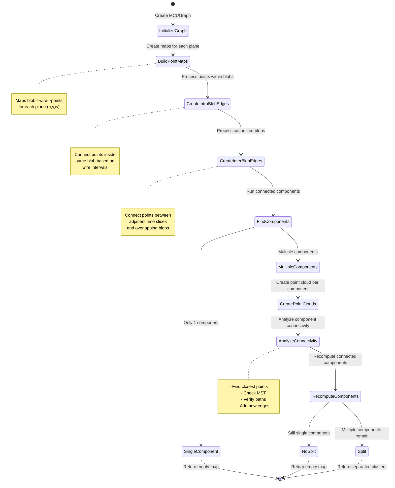

Let me explain the logic and algorithm of `Examine_overclustering` using a diagram and detailed breakdown.




Let me explain the key steps of this algorithm:

1. **Graph Initialization**:
   - Creates a boost graph with N vertices, where N is the number of points in the cluster
   - Each vertex represents a 3D point in the cluster

2. **Point Mapping**:
   - Creates maps that associate blobs (detector regions) with wire indices and point indices for each plane (u,v,w)
   - This allows efficient lookup of points that share wire intersections

3. **Intra-Blob Edge Creation**:
   - For each blob, connects points within it based on wire intervals
   - Uses maximum and minimum wire intervals as constraints
   - Calculates distances between points and adds edges to the graph with distance weights

4. **Inter-Blob Edge Creation**:
   - Identifies connected blobs:
     - Blobs in the same time slice that overlap
     - Blobs in adjacent time slices that overlap
   - Creates edges between points in connected blobs
   - Uses closest point pairs between blobs
   - Stores distances for edge weights

5. **Component Analysis**:
   - Runs connected components algorithm on the graph
   - If only one component is found, returns empty (no overclustering)
   - If multiple components are found, proceeds with detailed analysis

6. **Detailed Component Analysis** (for multiple components):
   - Creates point clouds for each component
   - Analyzes connectivity between components:
     - Finds closest points between components
     - Creates Minimum Spanning Tree (MST)
     - Checks path validity through detector space
     - Adds new edges based on directionality analysis
   - Recomputes connected components after adding new edges

7. **Final Split Decision**:
   - If components remain disconnected after detailed analysis:
     - Creates new clusters for each component
     - Maps points to their new clusters
   - If components become connected, returns empty (no overclustering)

The key innovation in this algorithm is its multi-stage approach:
- First pass with basic connectivity
- Second pass with detailed analysis for potential splits
- Path validation to ensure physically meaningful splits
- Use of MST to find optimal connection points between components

This algorithm helps prevent overclustering by identifying genuinely separate particle trajectories that may have been incorrectly grouped together, while avoiding splitting truly connected trajectories that may appear disconnected due to detector effects or noise.

The output is either:
- An empty map (if no valid splits are found)
- A map of new clusters (if valid splits are identified)

Each split decision is validated using multiple criteria including physical space constraints, wire plane geometry, and temporal relationships between detector hits.


```cpp
// Key data structures
struct ClusteringParams {
    // Graph creation
    using MCUGraph = boost::adjacency_list
        boost::vecS,                    // OutEdgeList: vector for edges
        boost::vecS,                    // VertexList: vector for vertices
        boost::undirectedS,            // Directionality: undirected
        VertexProperties,              // Vertex properties: index
        EdgeProperties                 // Edge properties: distance
    >;

    // Point mapping structures
    using wire_point_map_t = std::map<int, std::set<int>>;        // wire_index -> set<point_index>
    using blob_wire_points_map_t = std::map<const Blob*, wire_point_map_t>;  // blob -> (wire -> points)

    // Distance thresholds (in cm)
    static constexpr double CLOSE_DISTANCE_THRESHOLD = 3.0;      // Direct connection threshold
    static constexpr double PATH_STEP_SIZE = 1.0;               // Path validation step size
    static constexpr double MAX_CONNECTION_DISTANCE = 80.0;     // Maximum allowed connection
    static constexpr double STANDARD_DISTANCE = 5.0;            // Standard connection threshold

    // Path validation parameters
    static constexpr int MAX_BAD_POINTS = 7;                    // Maximum allowed bad points in path
    static constexpr double MAX_BAD_RATIO = 0.75;              // Maximum ratio of bad points
    
    // Time slice parameters
    static constexpr int MAX_TIME_GAP = 2;                     // Maximum allowed time slice gap
    static constexpr int MIN_POINTS_LARGE_CLUSTER = 500;       // Min points for detailed analysis
};

// Key algorithmic steps
class ClusteringAlgorithm {
    // Component analysis thresholds
    bool shouldPerformDetailedAnalysis(const PointCloud& cloud1, const PointCloud& cloud2) {
        return (cloud1.size() > 100 && cloud2.size() > 100 && 
                (cloud1.size() + cloud2.size()) > 400) ||
               (cloud1.size() > 500 && cloud2.size() > 500);
    }

    // Path validation
    bool isValidPath(const Point& p1, const Point& p2, double step_size) {
        double distance = p1.distance(p2);
        int num_steps = distance / step_size + 1;
        int bad_points = 0;

        for (int i = 0; i < num_steps; i++) {
            Point test_p = p1.interpolate(p2, (i + 1.0) / num_steps);
            if (!grouping->is_good_point(test_p, 0)) {
                bad_points++;
                if (bad_points > MAX_BAD_POINTS || 
                    (bad_points > 2 && bad_points >= 0.75 * num_steps)) {
                    return false;
                }
            }
        }
        return true;
    }

    // Directional analysis parameters
    struct DirectionalParams {
        static constexpr double SEARCH_RADIUS = 30.0;          // cm, for Hough transform
        static constexpr double MAX_ANGLE = 7.5;               // degrees, for direction matching
        static constexpr double TOLERANCE = 3.0;               // cm, for point matching
        static constexpr double MAX_EXTENSION = 80.0;          // cm, maximum extension length
    };
};

```

Here are the key technical details added to the algorithm explanation:

1. **Graph Data Structure Details**:
   - Uses Boost's adjacency_list with vector storage for both vertices and edges
   - Undirected graph with vertex properties (index) and edge properties (distance)
   - Efficient lookup through vertex descriptors

2. **Point Mapping Refinements**:
   - Three-plane mapping (u,v,w) with separate wire indices
   - Hierarchical maps: blob → wire_index → set<point_index>
   - Optimized for quick lookup of points sharing wire intersections

3. **Connectivity Analysis Parameters**:
   - Close distance threshold: 3cm for direct connections
   - Standard distance: 5cm for regular connections
   - Maximum connection distance: 80cm for extended searches
   - Path validation step size: 1cm for fine-grained checking

4. **Time Slice Processing**:
   - Handles gaps of up to 2 time slices
   - Uses nticks_live_slice for time slice spacing
   - Processes adjacent slices in groups of t, t+1, t+2
   - Maintains temporal ordering in connectivity analysis

5. **Component Analysis Thresholds**:
   - Detailed analysis triggered for clusters with:
     - Both components > 100 points AND combined > 400 points
     - OR both components > 500 points
   - Uses point cloud KD-trees for efficient nearest neighbor searches

6. **Path Validation Criteria**:
   - Maximum 7 bad points allowed in path
   - Bad point ratio threshold: 75%
   - Step size: 1.0cm for path checking
   - Validates points using grouping->is_good_point()

7. **Directional Analysis**:
   - Search radius: 30cm for Hough transform
   - Maximum angle deviation: 7.5 degrees
   - Point matching tolerance: 3cm
   - Maximum extension length: 80cm

8. **MST (Minimum Spanning Tree) Analysis**:
   - Creates MSTs for both standard and directional connections
   - Uses Prim's algorithm with distance weights
   - Handles multiple connected components separately
   - Validates MST edges with path checking

This enhanced detail shows how the algorithm balances multiple factors:
- Physical constraints of the detector
- Computational efficiency through appropriate data structures
- Robust validation through multiple criteria
- Flexible handling of different cluster sizes and configurations

The final output maintains consistency with the detector's physical characteristics while properly separating genuinely distinct clusters that may have been incorrectly merged.