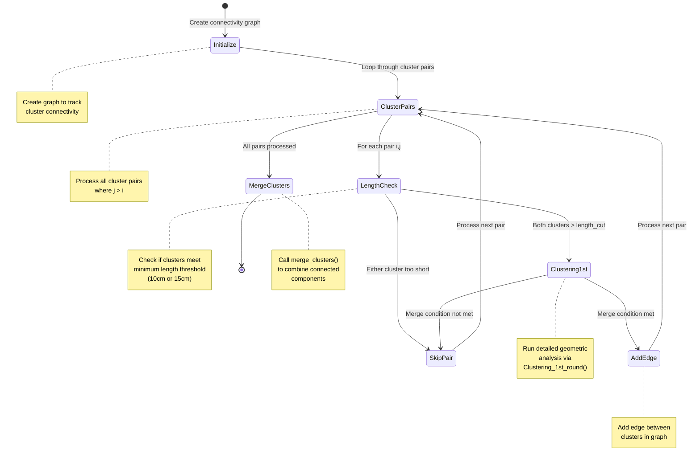

I'll explain the `clustering_regular` function which handles the high-level clustering logic for groups of clusters.



Let's analyze the code and logic in detail:

1. **Function Parameters and Initialization**:
```cpp
void WireCell::PointCloud::Facade::clustering_regular(
    Grouping& live_grouping,
    cluster_set_t& cluster_connected_dead,  // in/out
    const double length_cut,                // default 45cm
    bool flag_enable_extend                 // enable extended analysis
)
{
    // Internal length threshold depends on extend mode
    double internal_length_cut = flag_enable_extend ? 15*units::cm : 10*units::cm;
```
Key points:
- Takes a group of "live" clusters and already connected "dead" clusters
- `length_cut` determines maximum merge distance (default 45cm)  
- `flag_enable_extend` enables more aggressive merging checks
- Sets internal minimum cluster length threshold

2. **Graph Setup**:
```cpp
typedef cluster_connectivity_graph_t Graph;
Graph g;
std::unordered_map<int, int> ilive2desc;  // live index to graph descriptor
std::map<const Cluster*, int> map_cluster_index;
const auto& live_clusters = live_grouping.children();

// Create vertices for each cluster
for (size_t ilive = 0; ilive < live_clusters.size(); ++ilive) {
    const auto& live = live_clusters.at(ilive);
    map_cluster_index[live] = ilive;
    ilive2desc[ilive] = boost::add_vertex(ilive, g);
}
```
Key points:
- Uses Boost Graph Library to track cluster connectivity
- Creates a vertex for each cluster in the graph 
- Maintains mappings between:
  - Cluster pointers and their indices
  - Indices and graph vertex descriptors

3. **Main Clustering Loop**:
```cpp
for (size_t i=0; i!=live_clusters.size(); i++) {
    auto cluster_1 = live_clusters.at(i);
    if (cluster_1->get_length() < internal_length_cut) continue;
    
    for (size_t j=i+1; j<live_clusters.size(); j++) {
        auto cluster_2 = live_clusters.at(j);
        if (cluster_2->get_length() < internal_length_cut) continue;

        if (Clustering_1st_round(*cluster_1, *cluster2, 
                               cluster_1->get_length(), 
                               cluster_2->get_length(), 
                               length_cut, 
                               flag_enable_extend)) {
            boost::add_edge(ilive2desc[map_cluster_index[cluster_1]],
                          ilive2desc[map_cluster_index[cluster2]], g);
        }
    }
}
```
Key points:
- Double loop processes each unique pair of clusters once
- Skips clusters shorter than internal_length_cut
- Calls `Clustering_1st_round` to check if clusters should merge
- Adds graph edge when merge condition is met

4. **Final Merging**:
```cpp
merge_clusters(g, live_grouping, cluster_connected_dead);
```
Key points:
- Takes connectivity graph and applies merges
- Updates both live clusters and connected dead clusters

The algorithm works by:

1. **Preprocessing**:
   - Sets up a graph structure to track which clusters should be merged
   - Filters out clusters that are too short to consider
   - Creates necessary index mappings

2. **Pair Analysis**:
   - Systematically examines each unique pair of clusters
   - Uses detailed geometric analysis via Clustering_1st_round
   - Records merge decisions in graph structure

3. **Merge Decisions** are based on:
   - Cluster lengths (must exceed minimum threshold)
   - Geometric relationships (via Clustering_1st_round)
   - Distance between clusters (vs length_cut)
   - Extended analysis if enabled

4. **Graph Building**:
   - Each cluster is a vertex
   - Edges represent merge decisions
   - Connected components in final graph become merged clusters

5. **Final Processing**:
   - Graph is passed to merge_clusters
   - Connected components are combined
   - Results update both live and dead cluster sets

This approach has several advantages:
- Efficient handling of multiple clusters
- Consistent merge decisions
- Ability to handle complex merge patterns
- Clean separation between decision logic and merge implementation

The function acts as a high-level coordinator for the clustering process, delegating detailed geometric analysis to `Clustering_1st_round` while managing the overall merge structure through graph theory concepts.


I'll break down the detailed logic of `Clustering_1st_round` function step by step.


Let's analyze the detailed implementation:

1. **Initialization and Basic Distance Check**:
```cpp
const auto [angle_u,angle_v,angle_w] = cluster1.grouping()->wire_angles();
geo_point_t p1, p2;
double dis = Find_Closest_Points(cluster1, cluster2, length_1, length_2, length_cut, p1, p2);
if (dis >= length_cut) return false;
```

2. **Flag Calculation and Direction Analysis**:
```cpp
// Calculate average positions and directions
geo_point_t cluster1_ave_pos = cluster1.calc_ave_pos(p1, 5*units::cm);
geo_point_t cluster2_ave_pos = cluster2.calc_ave_pos(p2, 5*units::cm);

// Calculate direction vectors
geo_point_t dir2_1(p2.x() - p1.x()+1e-9, p2.y() - p1.y()+1e-9, p2.z() - p1.z()+1e-9);
geo_point_t dir2(cluster2_ave_pos.x() - cluster1_ave_pos.x()+1e-9,
                 cluster2_ave_pos.y() - cluster1_ave_pos.y()+1e-9,
                 cluster2_ave_pos.z() - cluster1_ave_pos.z()+1e-9);
```

3. **Parallel Case Analysis**:
```cpp
// Check if clusters are perpendicular to drift direction
double angle1 = dir2_1.angle(drift_dir);
double angle2 = dir2.angle(drift_dir);

if (fabs(angle1-3.1415926/2.) < 7.5/180.*3.1415926 ||
    fabs(angle2-3.1415926/2.) < 7.5/180.*3.1415926) {
    flag_para = true;
    
    // Check alignment with U/V wires
    angle3 = dir2_1.angle(U_dir);
    angle4 = dir2_1.angle(V_dir);
    
    if (fabs(angle3-3.1415926/2.) < 7.5/180.*3.1415926) flag_para_U = true;
    if (fabs(angle4-3.1415926/2.) < 7.5/180.*3.1415926) flag_para_V = true;
}
```

4. **Prolonged Case Analysis**:
```cpp
if (!flag_para) {
    // Calculate projections onto wire planes
    geo_point_t tempV3(0, p2.y() - p1.y(), p2.z() - p1.z());
    
    // Check alignment with wire directions
    double angle6 = tempV3.angle(U_dir);
    double angle7 = tempV3.angle(V_dir);
    double angle8 = tempV3.angle(W_dir);
    
    if (angle6 < 15/180.*3.1415926) flag_prolong_U = true;
    if (angle7 < 15/180.*3.1415926) flag_prolong_V = true;
    if (angle8 < 15/180.*3.1415926) flag_prolong_W = true;
}
```

5. **Regular Case Analysis**:
```cpp
if (dis <= 15*units::cm) {
    flag_regular = true;
} else if (length_1 > 30*units::cm && length_2 > 30*units::cm) {
    if (dis <= 25*units::cm) flag_regular = true;
}
```

6. **Extended Analysis**:
```cpp
if (flag_extend && flag_enable_extend || flag_force_extend) {
    // Get cluster directions using Hough transform
    geo_point_t dir1 = cluster1.vhough_transform(cluster1_ave_pos, 30*units::cm);
    geo_point_t dir3 = cluster2.vhough_transform(cluster2_ave_pos, 30*units::cm);
    
    // Test multiple points along clusters
    for (int i=-5; i!=6; i++) {
        test_point.set(cluster1_ave_pos.x() - dir1.x() * (ave_dis + i*2*units::cm),
                      cluster1_ave_pos.y() - dir1.y() * (ave_dis + i*2*units::cm),
                      cluster1_ave_pos.z() - dir1.z() * (ave_dis + i*2*units::cm));
        
        // Check continuity and alignment
        auto temp_results = cluster2.get_closest_point_blob(test_point);
        // ... distance calculations and checks
    }
}
```

7. **Angle Criteria Adjustment**:
```cpp
double angle_cut = 2.5;
if (dis < 5*units::cm) {
    angle_cut = 12;
} else if (dis < 15*units::cm) {
    angle_cut = 7.5;
} else {
    angle_cut = 5;
}
```

The algorithm uses several key parameters:
1. **Distance Thresholds**:
   - Basic cutoff: 45cm (default length_cut)
   - Regular case: 15cm
   - Extended analysis: various multiples of cluster length

2. **Angle Thresholds**:
   - Parallel case: 7.5° from perpendicular
   - Wire alignment: 15° from wire directions
   - Distance-dependent angle cuts: 5° to 12°

3. **Length Requirements**:
   - Minimum length: 10cm (15cm in extend mode)
   - Long cluster threshold: 30cm

The function balances between:
- Geometric constraints (angles, distances)
- Physical considerations (wire directions, drift direction)
- Cluster properties (length, continuity)
- Multiple validation methods (direct measurement, Hough transform)

This creates a robust clustering algorithm that can handle various track configurations while minimizing false merges.


