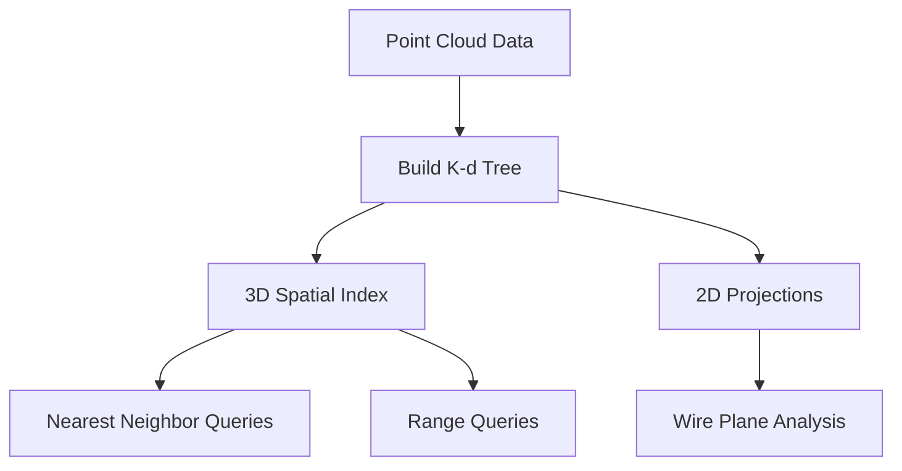
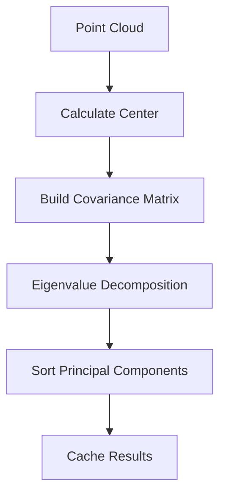
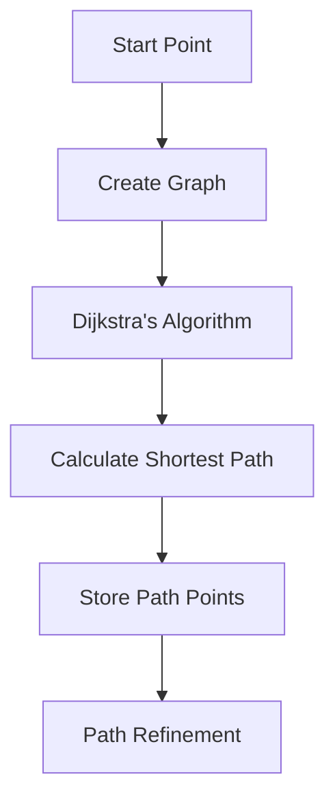
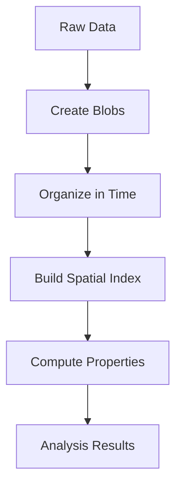

I'll create a detailed explanation of the Facade_Cluster class structure, logic, and algorithms.


# Facade_Cluster Class Architecture

## 1. Class Hierarchy and Design Pattern

### Inheritance Structure
```
NaryTree::FacadeParent<Blob, points_t>
         ↑
    Facade_Cluster
```

The Facade_Cluster class inherits from NaryTree::FacadeParent and implements the Facade design pattern to:
- Provide a simplified interface to a complex point cloud data structure
- Manage relationships between blobs (collections of points)
- Handle spatial and temporal organization of detector data

### Core Components
1. **Point Cloud Management**
   - 3D point storage and indexing
   - 2D projections for wire planes
   - K-d trees for efficient spatial queries

2. **Blob Organization**
   - Hierarchical structure of points grouped into blobs
   - Time-based organization
   - Spatial relationships between blobs

3. **Graph Structure**
   - Represents connectivity between points
   - Supports path finding and trajectory analysis
   - Handles cluster connectivity

## 2. Data Structures

### Core Data Members
```cpp
// Cached values
mutable double m_length{0};          // Cluster length
mutable int m_npoints{0};            // Total point count
mutable time_blob_map_t m_time_blob_map;  // Time-ordered blob mapping

// PCA related
mutable bool m_pca_calculated{false};
mutable geo_point_t m_center;
mutable geo_vector_t m_pca_axis[3];
mutable double m_pca_values[3];

// Graph related
mutable std::unique_ptr<MCUGraph> m_graph;
mutable std::vector<vertex_descriptor> m_parents;
mutable std::vector<int> m_distances;
mutable int m_source_pt_index{-1};
mutable std::list<size_t> m_path_wcps;
mutable std::list<const Blob*> m_path_mcells;
```

### Key Scopes
```cpp
const Tree::Scope scope_3d_raw = {"3d", {"x", "y", "z"}};
const Tree::Scope scope_wire_index = {"3d", {"uwire_index", "vwire_index", "wwire_index"}};
Tree::Scope scope2ds[3] = {
    {"2dp0", {"x", "y"}},
    {"2dp1", {"x", "y"}},
    {"2dp2", {"x", "y"}}
};
```

## 3. Core Algorithms

### 3.1 Spatial Organization

#### K-d Tree Construction and Usage


#### PCA Analysis Flow


### 3.2 Graph Construction Algorithm

```cpp
1. Initialize graph structure
2. Establish_close_connected_graph:
   - Create edges within blobs
   - Connect overlapping blobs
   - Apply distance-based cuts
3. Connect_graph:
   - Find connected components
   - Create additional edges between components
   - Validate connections using CTPC (optional)
```

### 3.3 Path Finding Process



## 4. Key Workflows

### 4.1 Cluster Analysis Workflow


### 4.2 Track Finding Process
1. **Initial Setup**
   ```cpp
   - Create point cloud structure
   - Build k-d trees
   - Establish blob relationships
   ```

2. **Graph Construction**
   ```cpp
   - Create_graph()
   - Establish_close_connected_graph()
   - Connect_graph()
   ```

3. **Path Finding**
   ```cpp
   - dijkstra_shortest_paths()
   - cal_shortest_path()
   - get_path_wcps()
   ```

## 5. Implementation Details

### 5.1 Point Cloud Management
- Uses lazy initialization for k-d trees
- Maintains separate 2D projections for wire planes
- Implements efficient spatial queries

### 5.2 Blob Organization
- Hierarchical structure of points
- Time-based mapping
- Spatial relationship tracking

### 5.3 Graph Management
- Boost Graph Library integration
- Custom edge and vertex properties
- Path finding algorithms

## 6. Performance Considerations

### 6.1 Caching Strategy
```cpp
// Example of lazy initialization and caching
const time_blob_map_t& time_blob_map() const {
    if (m_time_blob_map.empty()) {
        // Build map only when needed
        for (const Blob* blob : children()) {
            m_time_blob_map[blob->slice_index_min()].insert(blob);
        }
    }
    return m_time_blob_map;
}
```

### 6.2 Memory Management
- Lazy initialization of expensive structures
- Caching of computed values
- Smart pointer usage for graph management

### 6.3 Computational Efficiency
- K-d tree for spatial queries: O(log n)
- Dijkstra's algorithm: O(E log V)
- PCA computation: O(n)

## 7. Usage Examples

### 7.1 Basic Point Cloud Operations
```cpp
// Create cluster and add points
Cluster cluster;
// ... add points and blobs ...

// Perform spatial query
geo_point_t query_point(0, 0, 0);
auto nearby = cluster.nnearby(query_point, 5.0 * units::cm);
```

### 7.2 Track Finding
```cpp
// Setup cluster
cluster.Create_graph(true);
cluster.dijkstra_shortest_paths(start_index);
cluster.cal_shortest_path(end_index);
auto path = cluster.get_path_wcps();
```

## 8. Extension Points

The class is designed for extension through:
1. Template specialization for different point types
2. Custom blob implementations
3. Additional graph algorithms
4. New spatial analysis methods

## 9. Error Handling

The class uses:
- Exception throwing for invalid operations
- Boundary checking for indices
- Validation of geometric operations
- Sanity checks for graph operations


This documentation provides a comprehensive overview of the Facade_Cluster class architecture. Would you like me to:
1. Add more detailed algorithm explanations?
2. Provide more specific code examples?
3. Explain any particular aspect in more detail?