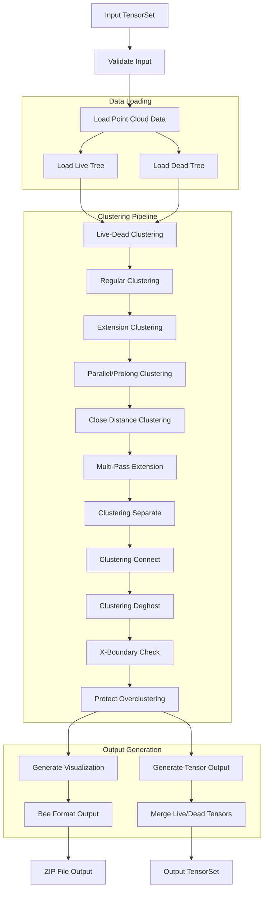

# MultiAlgBlobClustering Class Analysis

## Overview
MultiAlgBlobClustering is a class designed for clustering point cloud data in a wire cell detector, specifically handling both "live" and "dead" regions. It's part of the WireCell clustering system and implements multiple interfaces including ITensorSetFilter, IConfigurable, and ITerminal.

## Class Structure

### Key Interfaces
- `ITensorSetFilter`: For processing tensor sets
- `IConfigurable`: For configuration management
- `ITerminal`: For finalization operations
- `Aux::Logger`: For logging capabilities

### Important Member Variables
1. Data Management:
   - `m_sink`: Bee::Sink for ZIP file output
   - `m_bee_img`, `m_bee_ld`: Bee::Points for visualization
   - `m_bee_dead`: Bee::Patches for dead regions
   - `m_last_ident`: Tracks the last processed identifier

2. Configuration Parameters:
   - `m_inpath`: Input path pattern for point cloud data
   - `m_outpath`: Output path pattern
   - `m_dead_live_overlap_offset`: Overlap offset for dead-live clustering
   - `m_x_boundary_low_limit`, `m_x_boundary_high_limit`: X-axis boundaries
   - `m_save_deadarea`: Flag for saving dead area information
   - `m_perf`: Performance monitoring flag

## Workflow

### 1. Initialization
- Constructor initializes logging and Bee visualization components
- Configuration is handled via `configure()` method, setting paths and parameters

### 2. Main Processing Pipeline
The core processing happens in the `operator()` method:

1. Input Validation
   - Checks for end-of-stream condition
   - Validates input tensor set

2. State Management
   - Manages identifiers for continuous processing
   - Handles flushing of visualization data

3. Data Loading
   - Loads live point cloud tree
   - Loads dead point cloud tree
   - Initializes clustering structures

4. Clustering Process
The clustering pipeline involves multiple stages:

a) Live-Dead Clustering
   - Connects live regions with dead regions
   - Uses overlap offset parameter

b) Extension Clustering
   - Extends tracks in multiple passes
   - Handles parallel and prolonged tracks
   - Uses different distance thresholds

c) Regular Clustering
   - Processes standard clustering with and without extension
   - Uses configurable distance parameters

d) Specialized Clustering
   - Parallel and prolonged track handling
   - Close distance clustering
   - Boundary examination
   - Overclustering protection

5. Output Generation
   - Creates visualization data (Bee format)
   - Generates output tensor sets
   - Merges live and dead region data

### 3. Finalization
- Handles cleanup via `finalize()` method
- Flushes remaining data
- Closes output files

## Key Algorithms

1. **Clustering Live-Dead**
   - Purpose: Connect live regions with dead regions
   - Parameters: Uses `m_dead_live_overlap_offset`
   - Implementation: Analyzes overlap between live and dead regions

2. **Clustering Extension**
   - Purpose: Extend tracks and connect fragments
   - Multiple passes with different parameters:
     - Long distance (150cm) for prolonged tracks
     - Medium distance (30cm) for parallel tracks
     - Short distance (15cm) for regular connections

3. **Clustering Regular**
   - Purpose: Standard clustering operations
   - Two modes:
     - Without extension (60cm threshold)
     - With extension (30cm threshold)

4. **Specialized Clustering**
   - Parallel/Prolonged: Handles special track cases
   - Close Distance: For nearby point merging
   - Boundary Examination: Checks X-axis boundaries
   - Overclustering Protection: Prevents excessive merging

## Performance Monitoring

The class includes a comprehensive performance monitoring system:
- Uses `ExecMon` for timing measurements
- Provides detailed logging of cluster statistics
- Configurable via `m_perf` flag

## Visualization Output

The class generates multiple visualization outputs:
1. Live clusters visualization
2. Dead-live interaction visualization
3. Dead regions visualization (optional)
4. Output in Bee format for visualization tools

## Error Handling
- Robust input validation
- Logging of processing stages
- Configuration validation
- Memory management for point cloud trees

The MultiAlgBlobClustering class is a sophisticated component for processing point cloud data in wire cell detectors. It implements multiple clustering algorithms to handle both live and dead regions in the detector.

The key features of the class include:

1. Flexible input/output handling with configurable paths
2. Multiple clustering stages with different strategies
3. Performance monitoring capabilities
4. Visualization output in Bee format
5. Comprehensive error handling and logging

The class processes data through several stages:
1. First validates and loads point cloud data
2. Applies multiple clustering algorithms in sequence
3. Generates both visualization and tensor outputs
4. Handles cleanup and finalization

