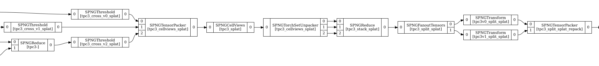
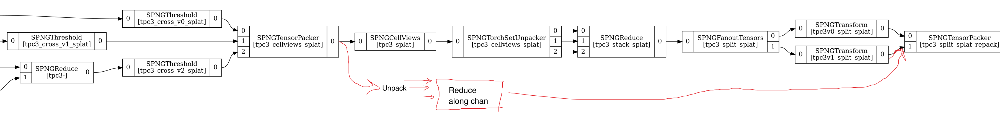
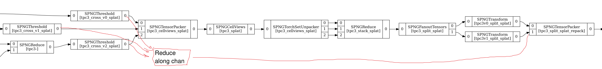

### Introduction
This page describes a 'case-study' in extending the a 'complete' graph. The goal here is to lay out my own thought process as a way to show difficulties in designing the extension, and hopefully uncover where the configuration system/scheme/patterns can be improved. 

### Initial graph 

The above image shows the relevant portion of the graph I am planning to extend. Further to the right in the graph (i.e. after the tensor packer), the available tensors get written to a file. These tensors are the MP2 and MP3 tensors after going through CellViews of a resampled & thresholded splat frame. 

### Description of what I want to achieve
I would like to include the resampled & thresholded splat frame in the output. At some point, I need to concatenate the data along the channel dimension (like I do for the CellView'd data). I can't do this before putting it into cell views, so I need to fan the data out at some point. We have 2 clear options where this can occur:

### Graph 'Strategies'

#### 1: Fanout TensorSet immediately before CellViews (after packing)

#### 2: Fanout Tensors before packing

There isn't any clear winner yet. Option 2 is appealing because we don't have to unpack before concatenating, though I require 2 more fanouts. I don't think there's any real practical difference in terms of performance etc. I haven't looked too deeply into the configuration with this all in mind yet, but at this point, I think option 1 would be better because I don't have to worry about the fanouts. We'll see whether that's true. 
