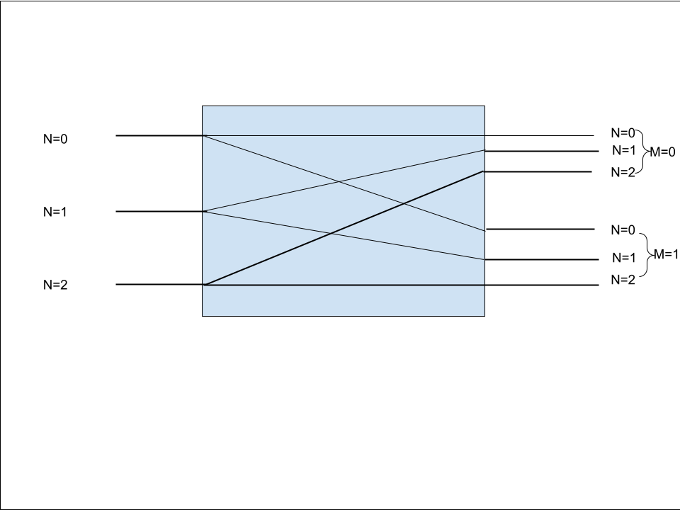
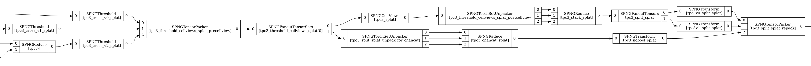

### Introduction
This page describes a 'case-study' in extending the a 'complete' graph. The goal here is to lay out my own thought process as a way to show difficulties in designing the extension, and hopefully uncover where the configuration system/scheme/patterns can be improved. 

### Initial graph 

The above image shows the relevant portion of the graph I am planning to extend. Further to the right in the graph (i.e. after the tensor packer), the available tensors get written to a file. These tensors are the MP2 and MP3 tensors after going through CellViews of a resampled & thresholded splat frame. 

### Description of what I want to achieve
I would like to include the resampled & thresholded splat frame in the output. At some point, I need to concatenate the data along the channel dimension (like I do for the CellView'd data). I can't do this before putting it into cell views, so I need to fan the data out at some point. We have 2 clear options where this can occur:

### Graph 'Strategies'

#### 1: Fanout TensorSet immediately before CellViews (after packing)

#### 2: Fanout Tensors before packing

There isn't any clear winner yet. Option 2 is appealing because we don't have to unpack before concatenating, though I require 2 more fanouts. I don't think there's any real practical difference in terms of performance etc. I haven't looked too deeply into the configuration with this all in mind yet, but at this point, I think option 1 would be better because I don't have to worry about the fanouts. We'll see whether that's true. 

### Analyzing configuration
Below is the relevant portion of the config. I resample each group (U, V, W0, W1) then reduce W0&W1 -> Shared W view. So the shuntlines is rank 3 (views).
<pre>
    /// Put some of the previously-defined things together 
    /// This is one sticking point in the UI schema that I don't really like or at least
    /// took me a second to wrap my head around. What we're is defining progressively larger
    /// portions of the subgraph. The way we define that is by choosing some set of edges
    /// in the existing graph that we then have to splice and graft into in a way.
    threshold_cellviews_for_splat(out_views=[0,1,2], chunk_size=0, extra_name="_splat"):: 
        local this_name = $.this_name(extra_name, '_threshold_cellviews');

        local cellviews = $.cellviews_tensors(out_views=out_views, chunk_size=chunk_size, extra_name=extra_name);
        
        local name = $.this_name(extra_name, "_split");

        local stack = pg.pnode({
            type: 'SPNGReduce',
            name: $.this_name(extra_name, '_stack'),
            data: {
                multiplicity: 3,
                operation: "cat",
                dim: -2,
            } + control,
        }, nin=3, nout=1);

        pg.shuntlines([
            $.resample_group_to_views(extra_name=extra_name),
            pg.crossline($.thresholds_for_splat(extra_name=extra_name)),
            cellviews,
            stack,
        ]),
</pre>
Option 1 seeks to fanout the TensorSet immediately before the CellViews node. However, when I wrote this, I thought I'd save some space and take the 3 view tensors as input to the 'cellviews_tensors' function (it handles packing -> cellviews -> unpacking for me). Turns out, it would actually be nice to access the Packed TensorSet and fan it out. I could do that, and write packing/unpacking nodes explicitly here. That's not too hard. 
<pre>
    threshold_cellviews_for_splat(out_views=[0,1,2], chunk_size=0, extra_name="_splat"):: 
        local this_name = $.this_name(extra_name, '_threshold_cellviews');

        local n = std.length(out_views);
        local packer = pg.pnode({
            type: 'SPNGTensorPacker',
            name: this_name + '_precellview',
            data: {
                multiplicity: n
            } + control
        }, nin=n, nout=1);
        local cellviews = $.cellviews_tensorset(out_views=out_views, chunk_size=chunk_size, extra_name=extra_name);
        local unpacker = pg.pnode({
            type: 'SPNGTorchSetUnpacker',
            name: this_name + '_postcellview',
            data: {
                selections: [{index: ind} for ind in wc.iota(n)],
            } + control
        }, nin=1, nout=n);

        local cellviews_byhand = pg.pipeline([packer, cellviews, unpacker]);

        local stack = pg.pnode({
            type: 'SPNGReduce',
            name: $.this_name(extra_name, '_stack'),
            data: {
                multiplicity: 3,
                operation: "cat",
                dim: -2,
            } + control,
        }, nin=3, nout=1);

        pg.shuntlines([
            $.resample_group_to_views(extra_name=extra_name),
            pg.crossline($.thresholds_for_splat(extra_name=extra_name)),
            cellviews_byhand,
            stack,
        ]),
</pre>
I went ahead and split it up, checked it by rendering and also running wire-cell. It seems good, now to add the fanout functionality. Here's where I run into some conceptual issues. If I add in the fanout here, then both the 'cellviews_byhand' pipeline and the shuntlines doesn't seem so easy to fit into.. 

On a whim, I looked into fans.jsonnet. I think this might be useful here but I'm not sure 
<pre>
    /// Forward N ports M ways.
    ///
    /// It returns a list like:
    ///
    /// [N-sink, [N-source]*M]
    ///
    ///
    /// Each of N iports of the N-sink should be connected to upstream.
    ///
    /// Each of the N iports to each of the M N-sources should be connected to
    /// downstream.
    ///
    /// N is typically number of detector views in a TPC or number of TPCs in a
    /// detector.  M is whatever fanout number you want from each.
    fanout_cross(name, N, M, type='Tensor')::
        local fans = [pg.pnode({
            type: "SPNGFanout"+type+"s",
            name: name + "f" + std.toString(num),
            data: { multiplicity: M } + control
        }, nin=1, nout=M) for num in wc.iota(N)];
        local sink = pg.intern(innodes=fans); // sets their iports
        local sources = [
            pg.intern(centernodes=fans, // fixme, even give this?
                      oports=[
                          fans[fnum].oports[mnum]
                          for fnum in wc.iota(N)
                      ])
            for mnum in wc.iota(M)
        ];
        [sink, sources],

</pre>

Here's an attempt at me drawing this to try to understand it

So I think I could take the list of sinks (3), and the 2 list of targets (each 3) and use them. Could I put them in this shuntline? Looking further down, I see similar nodes being used in a very unintuitive way, so I'm just going to replicate this and hope the 'centernodes' portion takes care of everything. Still means I have to break up my shuntlines, which is a bummer and speaks to how fragile this is (IMO)
<pre>
        dnnroi_training_preface(crossed_views = [1,1,0], rebin=4, extra_name="")::
        local sg1 = $.frame_decon(extra_name=extra_name);

        local decon_fan = $.fanout_for_dnnroi_training(crossed_views,extra_name=extra_name);
        local sg1_connection = pg.shuntline(sg1, decon_fan.sink);

        // [3]tensor -> tensor[3]
        local sg2 = $.tight_roi(rebin=rebin, extra_name=extra_name);

        local dnnroi_views = [vi.index for vi in wc.enumerate(crossed_views) if vi.value == 1];

        // [3]tensor -> tensor[2]
        local sg3 = $.cellviews_tensors(out_views=dnnroi_views, chunk_size=0, extra_name=extra_name);

        // [3]tensor -> tensor[2] combo of two above
        local sg23 = pg.shuntline(sg2, sg3);
        local sg23_connection = pg.shuntline(decon_fan.targets.wiener, sg23);

        // [2]tensor -> tensor[2]
        local sg4 = $.dnnroi_dense_views(views=dnnroi_views, rebin=rebin, extra_name=extra_name);
        local sg4_connection = pg.shuntline(decon_fan.targets.dense, sg4);

        // mp_sink:[3]tensor + dense_sink:[2]tensor(decon) -> source:tensor[2]
        local sg5 = $.connect_dnnroi_stack(sg3, sg4, views=dnnroi_views, extra_name=extra_name);

        pg.intern(innodes=[sg1], outnodes=[sg5],
                  centernodes=[sg1_connection, sg23_connection, sg4_connection]),
</pre>

I made a small mistake in that last paragraph, I forgot I was intending to fanout the packer! So it's really a 1x2 cross not 3x2. Thought this slip-up was interesting to put in here.

I emulated what I saw in the last codeblock here:
<pre>
    
    /// Put some of the previously-defined things together 
    /// This is one sticking point in the UI schema that I don't really like or at least
    /// took me a second to wrap my head around. What we're is defining progressively larger
    /// portions of the subgraph. The way we define that is by choosing some set of edges
    /// in the existing graph that we then have to splice and graft into in a way.
    threshold_cellviews_for_splat(out_views=[0,1,2], chunk_size=0, extra_name="_splat"):: 
        local this_name = $.this_name(extra_name, '_threshold_cellviews');

        local n = std.length(out_views);
        local packer = pg.pnode({
            type: 'SPNGTensorPacker',
            name: this_name + '_precellview',
            data: {
                multiplicity: n
            } + control
        }, nin=n, nout=1);
        local cellviews = $.cellviews_tensorset(out_views=out_views, chunk_size=chunk_size, extra_name=extra_name);
        local unpacker = pg.pnode({
            type: 'SPNGTorchSetUnpacker',
            name: this_name + '_postcellview',
            data: {
                selections: [{index: ind} for ind in wc.iota(n)],
            } + control
        }, nin=1, nout=n);

        local packer_fanout = fans.fanout_cross(this_name, 1, 2, type='TensorSet');

        local stack = pg.pnode({
            type: 'SPNGReduce',
            name: $.this_name(extra_name, '_stack'),
            data: {
                multiplicity: 3,
                operation: "cat",
                dim: -2,
            } + control,
        }, nin=3, nout=1);
        local up_to_packer = pg.shuntlines([
            $.resample_group_to_views(extra_name=extra_name),
            pg.crossline($.thresholds_for_splat(extra_name=extra_name)),
            packer,
        ]);
        local packer_into_fanout = pg.pipeline([up_to_packer, packer_fanout[0]]);
        //Connect one packer branch to cellviews and unpacker
        local cellviews_byhand = pg.pipeline([
            packer_fanout[1][0],
            cellviews, unpacker
        ]);
        local connect_cv_to_stack = pg.shuntlines([cellviews_byhand, stack]);
        pg.intern(innodes=[up_to_packer], outnodes=[connect_cv_to_stack],
                  centernodes=[packer_into_fanout]),
</pre>

The graph looks ok up to now. I'll note that I'm still not returning the second packer branch. Because this was intended to be called in another function (I thought it'd be good to keep things separate), I have to start modifying that. Returning just this cellview branch results in a drawable graph (there is probably unconneted oports etc).

Here's where I call the above block (I apologize for my unclear naming)
<pre>
        cellviews_split_and_pack_mp2_mp3(out_views=[0,1,2], chunk_size=0, extra_name='_splat')::
        local name = $.this_name(extra_name, '_split');
            
        local cellviews = $.threshold_cellviews_for_splat(out_views=out_views, chunk_size=chunk_size, extra_name=extra_name);
        local packer = pg.pnode({
            type: 'SPNGTensorPacker',
            name: name + '_repack',
            data: {
                multiplicity: 2
            } + control
        }, nin=2, nout=1);
        local cellviews_split = pg.pipeline([cellviews, fans.fanout(name)]);
        local slicers = pg.crossline([
            pg.pnode({
                local meth_name = 'v'+std.toString(i)+"_split",
                local name = $.this_name(extra_name, meth_name),
                type:'SPNGTransform',
                name: name,
                data: {
                    operations: [
                        {operation: "slice", dims: [-3, i, i+1]},
                        {operation: "squeeze", dims: [0]}
                        {operation: "to", dtype: "int32"}
                    ],
                    tag: if i == 0 then 'mp2' else 'mp3', // Is this the right order?
                } + control,
            }, nin=1, nout=1) for i in wc.iota(2)
        ]);
        pg.shuntlines([
            cellviews_split,
            slicers,
            packer,
        ]),
</pre>

I'll need to change how I'm handling what's returned from 'threshold_cellviews_for_splat'. I intend to change what's returned from there to:
<pre>
        {
            cellviews_branch: pg.intern(innodes=[up_to_packer], outnodes=[connect_cv_to_stack],
                  centernodes=[packer_into_fanout]),
            packer_branch: packer_fanout[1][1]
        },
</pre>
So I can get both branches, then I also need to increase my packer rank in the outer block and reformat the shuntlines.

<pre>
    cellviews_split_and_pack_mp2_mp3(out_views=[0,1,2], chunk_size=0, extra_name='_splat')::
        local name = $.this_name(extra_name, '_split');
            
        local cellviews_packer = $.threshold_cellviews_for_splat(out_views=out_views, chunk_size=chunk_size, extra_name=extra_name);
        local unpacker = pg.pnode({
            type: 'SPNGTorchSetUnpacker',
            name: name + '_unpack_for_chancat',
            data: {
                selections: [{index: ind} for ind in wc.iota(3)],
            } + control
        }, nin=1, nout=3);
        local chancat = pg.pnode({
            type: 'SPNGReduce',
            name: $.this_name(extra_name, '_chancat'),
            data: {
                multiplicity: 3,
                operation: "cat",
                dim: -2,
            } + control,
        }, nin=3, nout=1);
        local toint = pg.pnode({
            type: 'SPNGTransform',
            name: $.this_name(extra_name, '_nobool'),
            data: {
                operations: [
                    { operation: "to", dtype: "int32"}
                ],
                tag: 'splat'
            } + control,
        }, nin=3, nout=1);
        local unpack_for_chancat = pg.shuntlines([unpacker, chancat]);
        local do_unpack_and_chancat = pg.pipeline([cellviews_packer.packer_branch, unpack_for_chancat, toint]);
        local packer = pg.pnode({
            type: 'SPNGTensorPacker',
            name: name + '_repack',
            data: {
                multiplicity: 3
            } + control
        }, nin=3, nout=1);
        local cellviews_split = pg.pipeline([cellviews_packer.cellviews_branch, fans.fanout(name)]);
        local slicers = pg.crossline([
            pg.pnode({
                local meth_name = 'v'+std.toString(i)+"_split",
                local name = $.this_name(extra_name, meth_name),
                type:'SPNGTransform',
                name: name,
                data: {
                    operations: [
                        {operation: "slice", dims: [-3, i, i+1]},
                        {operation: "squeeze", dims: [0]}
                        {operation: "to", dtype: "int32"}
                    ],
                    tag: if i == 0 then 'mp2' else 'mp3', // Is this the right order?
                } + control,
            }, nin=1, nout=1) for i in wc.iota(2)
        ]);
        local cellviews_split_and_slice = pg.shuntlines([
            cellviews_split,
            slicers,
        ]);

        pg.intern(
            innodes=[cellviews_split_and_slice, do_unpack_and_chancat],
            outnodes=[packer],
            edges=[
                pg.edge(cellviews_split_and_slice, packer, 0, 0),
                pg.edge(cellviews_split_and_slice, packer, 1, 1),
                pg.edge(do_unpack_and_chancat, packer, 0, 2),
            ]
        ),
</pre>
I've added what needs to be done. Had to add a couple of config structures + change from the neat shuntlines to an intern (oh well. I also had to add in another transform to change the dtype that I forgot about when planning this. Here is the completed graph:

